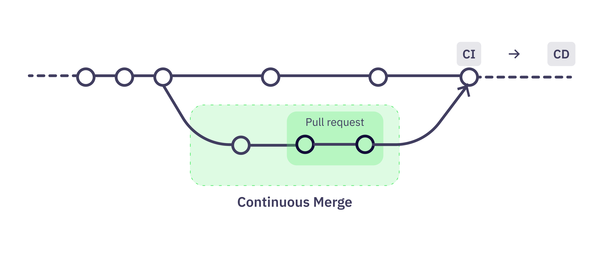

# /:\ gitStream

**gitStream automates your reviews, so you can focus human effort on what matters most.** Not all Pull Requests are the same. Some reviews can be automated, like changes using a specific API (deprecated, sensitive), changes that are non-functional, like docs or tests, or even reformatting code. Automate these reviews to reduce context switches by assigning specific people to review, approve, or even merge simple changes that passed all checks, and more.

### Documentation 

See [https://docs.gitstream.cm](https://docs.gitstream.cm)

### Issues 

Found a bug? create a new item in the project's [issues](https://github.com/linear-b/gitstream/issues)

### Continuous Merge

**Continuous Merge (CM)** is the practice of automating the merge path by classifying pull requests based on change type, size, and complexity to allow work to flow more efficiently.

### How it works

Every time a dev opens a new Pull Request or changes a Pull Request, gitStream is triggered. Next, the `.cm` file is used to determine which automatic actions are invoked based on their conditions. The resulting actions use GitHub API to achieve the desired outcome.

The next steps are common practice of changing code in repo:

1. Create a feature branch 
2. Commit changes  
3. Push branch to remote repo 
4. Open Pull Request 
