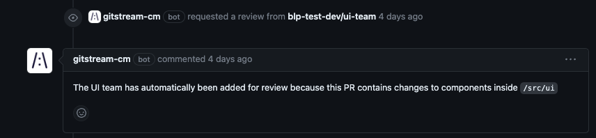

## Assign Reviewers by Directory

Automatically assign code reviewers based on directory structure. Optionally, you can substitue `require-reviewers` for `add-reviewers` to make review from the specified teams and individuals mandatory.

Conditions (all must be true):
* The PR contains changes to JavaScript files inside the `src/ui` directory.

Automation Actions:
* Add a user named `my-teamate` and a team named `my-organization/ui-team` as reviewers. These should be customized to match your organization.
* Post a comment explaining why these reviewers were assigned.

Visit the [gitStream docs](https://docs.gitstream.cm/) for more info about how to use this automation