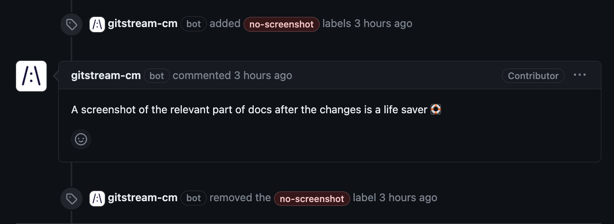

# Request Screenshot
If the PR lacks an image file, or link to an image in the description, apply a `no-screenshot` label and post a comment to request a screenshot. If the PR author updates the description, gitStream will remove the label.

Conditions (all must be true):
* The PR description lacks an image or link to an image.

Automation Actions:
* Apply a `no-screenshot` label.
* Post a comment that requests a screenshot. Update this action to provide specific context for your project.

Visit the [gitStream docs](https://docs.gitstream.cm/) for more info about how to use this automation

