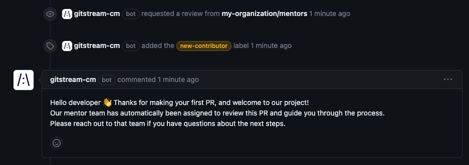

# Welcome Newcomer

Post a welcome message when someone makes their first PR to a repo, and provide context to help them know what's next.

Conditions (all must be true):
* The PR author made their first contribution to the repo during the current day.

Automation Actions:
* Add the `my-organization/mentors` team to review the PR. Customize this to match your organization.
* Apply a `new-contributor` label to the PR.
* Post a comment explaining the next steps. Customize this to match your project.

Visit the [gitStream docs](https://docs.gitstream.cm/) for more info about how to use this automation

