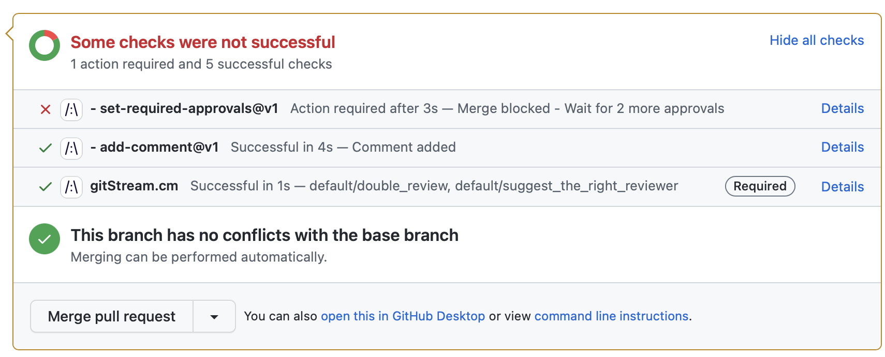

# Additional Review for Large PRs
Require 2 reviewers for PRs that have more than 10 changed files in the src directory and the estimated time to review is 30 or more minutes.

<div class="automationImage" style="align:right" markdown="1">

</div>

<div class="automationDescription" markdown="1">
!!! info "Configuration Description"
    Conditions (all must be true):

    * There are 10 or more changed files
    * The estimated time to review is 30 minutes or more.
    * One or more of the changed files is inside the `src` directory.

    Automation Actions:

    * Require a minumim of 2 reviews.
    * Post a comment that explains this is considered a large change that requires 2 reviews.
</div>

!!! example "Additional Review for Large PRs"
    ```yaml+jinja
    --8<-- "docs/downloads/automation-library/additional_review_for_large_pr.cm"
    ```
    <div class="result" markdown>
      <span>
      [:octicons-download-24: Download this example as a CM file.](/downloads/automation-library/additional_review_for_large_pr.cm){ .md-button }
      </span>
    </div>

## Additional Resources

--8<-- "docs/snippets/general.md"

**Related Automations**:

--8<-- "docs/snippets/review-assignment-automation.md:2:"

--8<-- "docs/snippets/automation-footer.md"
