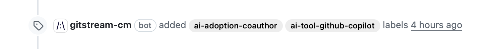

# AI Adoption Tracking

Automatically detect and label PRs that involve AI tool usage to track AI adoption across your development workflow.

**Supported AI Tools** (40+): Claude, Cursor, GitHub Copilot, Windsurf, Google Gemini, Aider, Qodo (PR-Agent), CodeRabbit, Devin AI, Amazon Q, and many more.



!!! info "Configuration Description"
    Tracks three types of AI adoption based on [LinearB's AI Insights](https://linearb.helpdocs.io/article/n8q4ydqmkd-ai-insights):

    * **Rules File** - Detects AI configuration files (`.cursorrules`, `CLAUDE.md`, etc.)
    * **Co-author** - Detects AI tools in commit co-author lines
    * **PR Author** - Detects PRs created by AI bots

    Automation Actions:

    * Apply labels: `ai-used`, `ai-adoption-*`, and `ai-tool-*`
    * Post explanatory comments

!!! example "AI Adoption Tracking"
    ```yaml+jinja
    --8<-- "docs/downloads/automation-library/ai_adoption_tracking.cm"
    ```
    <div class="result" markdown>
      <span>
      [:octicons-download-24: Download this example as a CM file.](/downloads/automation-library/ai_adoption_tracking.cm){ .md-button }
      </span>
    </div>

## How It Works

### Rules File Detection

The automation scans changed files for AI tool configuration patterns:

| Tool | Configuration Files |
|------|-------------------|
| Claude | `CLAUDE.md` |
| Cursor | `.cursorrules`, `.cursor/rules/*.md` |
| GitHub Copilot | `.github/copilot-instructions.md`, `.github/*-instructions.md` |
| Windsurf | `.windsurfrules` |
| Gemini | `GEMINI.md` |
| Aider | `.aider.conf.yml` |

When these files are added or modified, the PR is labeled with `ai-adoption-rules` and the specific tool label.

### Co-author Detection

The automation checks commit messages for AI co-authors using case-insensitive patterns:

```
Co-authored-by: Claude <noreply@anthropic.com>
Co-authored-by: GitHub Copilot <copilot@github.com>
```

Pattern format: `[Cc]o-[Aa]uthored-[Bb]y:.*[Tt]oolName`

This matches various capitalizations:
- `Co-authored-by: Claude`
- `co-authored-by: claude`
- `CO-AUTHORED-BY: CLAUDE`

### PR Author Detection

The automation identifies PRs created by AI bots:
- `claude[bot]`
- `github-copilot[bot]`
- `coderabbit[bot]`
- etc.

## Customization

### Track Additional Tools

Add new tools by extending the `config` section:

```yaml
config:
  # Add custom tool detection
  has_my_tool_rules: {{ files | match(regex=r/^\.mytool\/config\.yaml$/) | some }}
  has_my_tool_coauthor: {{ branch.commits.messages | match(regex=r/[Cc]o-[Aa]uthored-[Bb]y:.*[Mm]y[Tt]ool/) | some }}

  # Update any_ai_detected to include new tool
  any_ai_detected: {{ ... or has_my_tool_rules or has_my_tool_coauthor }}
```

Then add corresponding automation rules:

```yaml
automations:
  ai_rules_my_tool:
    if:
      - {{ config.has_my_tool_rules }}
    run:
      - action: add-label@v1
        args:
          label: 'ai-tool-mytool'
```

### Disable Comments

Remove `add-comment` actions to apply labels only without posting comments.

### Track Specific Tools Only

Remove automation rules for tools you don't want to track.

## Additional Resources

--8<-- "docs/snippets/general.md"

**Related Automations**:

* [Label PRs by Context](/automations/label-prs-by-context/) - Apply contextual labels to PRs
* [Track Code Experts](/automations/standard/explain-code-experts/) - Identify code ownership

--8<-- "docs/snippets/automation-footer.md"
