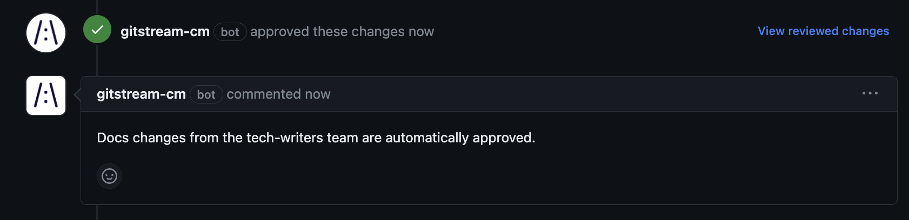

# Approve Trusted Team
Automatically approve low-risk PRs from trusted teams.

<div class="automationImage" style="align:right" markdown="1">

</div>
<div class="automationDescription" markdown="1">
!!! info "Configuration Description"
    Conditions (all must be true):

    * All changed files are inside the `docs` directory
    * The PR author is on the `tech-writers` team.

    Automation Actions:

    * Approve the PR
    * Post a comment that explains the approval.
</div>
!!! example "Approve Expert Team"
    ```yaml+jinja
    --8<-- "docs/downloads/automation-library/approve_team_by_directory.cm"
    ```
    <div class="result" markdown>
      <span>
      [:octicons-download-24: Download this example as a CM file.](/downloads/automation-library/approve_team_by_directory.cm){ .md-button }
      </span>
    </div>

## Additional Resources

--8<-- "docs/snippets/general.md"

**Related Automations**:

--8<-- "docs/snippets/safe-merge-automation.md::1"
--8<-- "docs/snippets/safe-merge-automation.md:3:"

--8<-- "docs/snippets/automation-footer.md"
