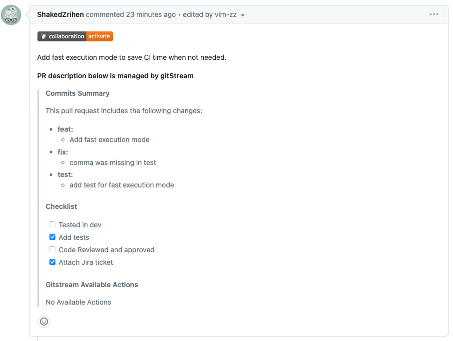

# Automatically Generate PR Description from Commit Messages

Automatically generate Pull Request descriptions based on commit messages. This automation helps ensure PR descriptions are consistent and informative.

!!! warning "Required gitStream Plugins"
    This example requires you to install the [`generateDescription`](/filter-function-plugins/#generatedescription) plugin.

    [Learn more about gitStream plugins](/plugins/).

<div class="automationImage" style="align:right" markdown="1">

</div>
<div class="automationDescription" markdown="1">
!!! info "Configuration Description"
    Conditions (all must be true):

    * A PR is created or has commits added to it.

    Automation Actions:

    * Update the PR description with auto-generated content based on commit messages.
</div>
<div class="automationExample" markdown="1">
!!! example "Generate PR Description"
    ```yaml+jinja
    --8<-- "docs/downloads/automation-library/generate_pr_description.cm"
    ```
    <div class="result" markdown>
      <span>
      [:octicons-download-24: Download this example as a CM file.](/downloads/automation-library/generate_pr_description.cm){ .md-button }
      </span>
    </div>
</div>

## Additional Resources

--8<-- "docs/snippets/general.md"

**Related Automations**:

--8<-- "docs/snippets/context-automation.md::2"
--8<-- "docs/snippets/context-automation.md:4:"

--8<-- "docs/snippets/automation-footer.md"
