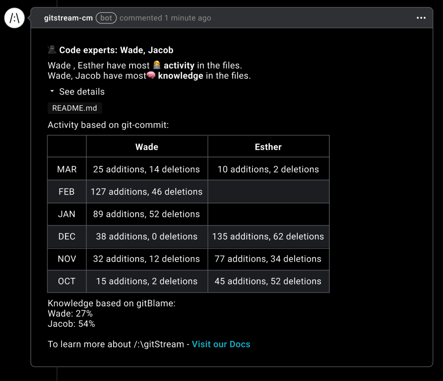

# Explain Code Experts

Post a comment that uses git blame and history to list the most relevant experts for all PRs. The comment will automatically update as additional commits are added to the PR.

<div class="automationImage" markdown="1">

</div>
<div class="automationDescription" markdown="1">
!!! info "Configuration Description"
    Conditions (all must be true):

    * A PR is created or modified.

    Automation Actions:

    * Post a comment that identifies the people with the highest level of code expetise.

</div>
<div class="automationExample" markdown="1">
!!! example "Explain Code Experts"
    ```yaml+jinja
    --8<-- "docs/downloads/automation-library/standard/explain_code_experts.cm"
    ```
    <div class="result" markdown>
      <span>
      [:octicons-download-24: Download this example as a CM file.](/downloads/automation-library/standard/explain_code_experts.cm){ .md-button }
      </span>
    </div>
</div>

## Additional Resources

--8<-- "docs/snippets/general.md"

**Related Automations**:

--8<-- "docs/snippets/review-assignment-automation.md::1"
--8<-- "docs/snippets/review-assignment-automation.md:3:"

--8<-- "docs/snippets/automation-footer.md"
