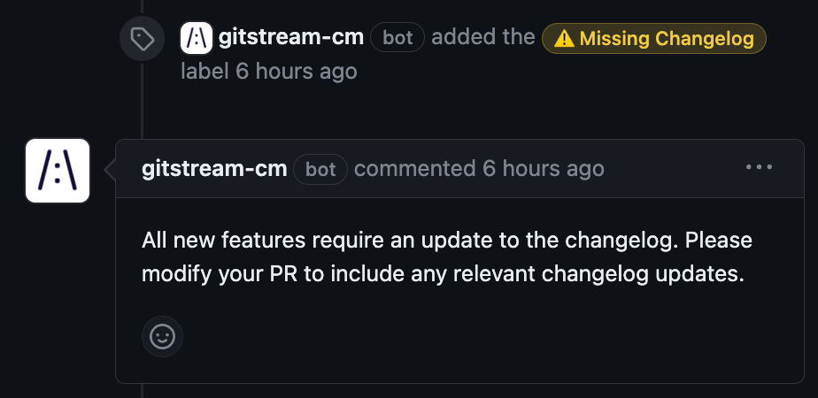

# Enforce Changelog Updates

Request changes if a PR that meets specified criteria lacks an update to the project's changelog.

<div class="automationImage" markdown="1">

</div>
<div class="automationDescription" markdown="1">
!!! info "Configuration Description"
    Conditions (All must be true):
    
    * The branch name contains the phrase `feature`
    * The PR lacks changes to the docs/changelog.md file

    Automation Actions:

    * Apply a yellow label that says `⚠️ Missing Changelog`
    * Request changes and post a comment explaining why.

</div>
<div class="automationExample" markdown="1">
!!! example "Review Changelog"
    ```yaml+jinja
    --8<-- "docs/downloads/automation-library/standard/review_changelog.cm"
    ```
    <div class="result" markdown>
      <span>
      [:octicons-download-24: Download this example as a CM file.](/downloads/automation-library/standard/review_changelog.cm){ .md-button }
      </span>
    </div>
</div>