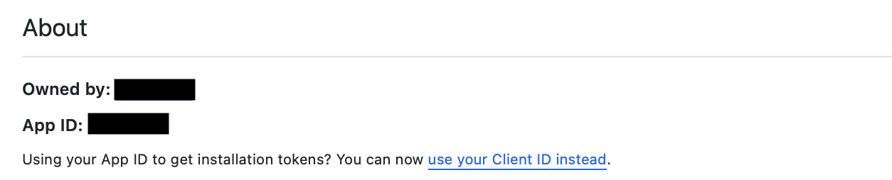

!!! Note

    This guide is for installations on self-hosted GitHub Server. If you are using the gitStream cloud service, please refer to [this guide](github-installation.md).

!!! Tip

    Multi-org support is also available by creating a `cm` organization and installing the app there. See step 11 for details on multi-org setup.

# Custom GitHub App for Self-Hosted GitHub Server

A GitHub application serves as the link between gitStream and GitHub. It facilitates user authentication via OAuth2 and allows users to select repositories accessible by gitStream.

!!! Info "Prerequisites"
    1. GitHub Server v3.10 or higher
    2. Allowed network connection between the server and the following IPs:
        - 13.56.203.235
        - 54.151.81.98

In this section, we'll guide you through creating a GitHub app for your self-hosted gitStream installation. By the end, you should have noted down the following values:

* App ID
* Private Key

!!! Note

    Throughout this document, when we refer to a GitHub account, it refers to your own GitHub Server installation.

## 1. Connect GitHub Server to LinearB

First <a href="https://app.linearb.io/login" target="_blank">login</a>, or <a href="https://app.linearb.io/sign-up" target="_blank">create a free account</a> on the LinearB app.

In LinearB, go to Settings -> Git -> click the `Connect gitStream` button next to your GitHub Server integration. You’ll need to use the **Webhook URL** and **Webhook secret** later when setting up the GitHub App.


Keep this window open and complete the next steps in GitHub. Once you have the **App ID** and **Private Key** (.pem file), you can complete the connection in LinearB.

## 2. Create a New GitHub App
Any GitHub account on your self-hosted GitHub Server can own the app, but we recommend creating it under the organization account of the team who will maintain the gitStream installation.

- Log in to your GitHub Server and go to your organization account page (e.g., `https://<GITHUB_SERVER_URL>/<organization account name>`)
- Navigate to *Settings -> Developer Settings -> GitHub Apps -> New GitHub App* as shown below
- Or go directly to `https://<GITHUB_SERVER_URL>/settings/apps`


## 3. Set Up URLs and General Information

Fill in the app information as shown in the screenshot below. For URLs, replace `gitstream.<your-domain>.com` with the actual endpoint at which you'll be hosting the gitStream application.

!!! Warning

    1. Do not forget trailing slashes for the URLs
    2. Do not forget to disable the "Expire user authorization tokens" checkbox
    3. The GitHub App name must contain `gitstream` in lower case

!!! Tip
    Use the following texts:

    1. GitHub App name: `gitstream app`
    2. Homepage URL: `https://gitstream.cm`


!!! Tip
    Use the following texts:

    1. **Webhook URL** from LinearB setup page
    2. **Webhook secret** from LinearB setup page


## 4. Set Up Permissions

We need the following permissions to enable all gitStream functionality:

- **Write access to dedicated gitStream app files:** Used to set up the gitStream workflow files
- **Write access to code:** To allow gitStream to approve PRs once all conditions are met
- **Read access to administration, issues, and metadata:** To get user team membership and branch protection settings
- **Read and write access to actions, checks, pull requests, and workflows:** Trigger workflows, create and update pull requests and their checks, and modify workflow files
- **User email:** Used to identify users                                       |

You need to enable these under the permissions section as shown below:


!!! Tip
    Add the following Path (content paths to single files the app can access):

    1. `.cm/gitstream.cm`
    2. `.github/workflows/gitstream.yml`


## 5. Webhook Events and Scope

* Subscribe to events so gitStream is notified when a PR is created, changed, or commented on, etc


!!! Tip

    *"Where can this GitHub App be installed?"* choose *"Any account"* so other orgs in your company can use gitStream as well. For on-prem installations that work with github.com, only repositories under your company's org account can be accessed via gitStream.


## 6. Generate a Private Key

Once the app is created, scroll down and click *Generate private key*. This will create and download a .pem file for you.

!!! Tip

    Please keep this file safe, we'll need to put it back in LinearB setup.


## 7. Upload a Logo

Download the logo file and upload the logo to your app.

- [Black logo](assets/gitstream-black.png)
- [White logo](assets/gitstream-white.png)

## 8. Get App Configuration

On your newly created app page, you can find the App ID.

!!! Tip

    Please keep the App ID, we'll need to put it back in LinearB setup.



## 9. Finish Setup in LinearB

To complete the integration, fill in the App ID and Private Key in the LinearB setup screen.

!!! Tip

    Use the App ID, and Private key (.pem file) to complete the LinearB setup.


## 10. Connect GitHub App to Your Repositories

Go to your organization settings in GitHub and navigate to **Third-party Access** to manage GitHub Apps. Select the account where you want to install the gitStream app. Choose the organization you used to create the GitHub app in the previous steps.

Alternatively, you can go directly to the app settings at `https://<GITHUB_SERVER_URL>/settings/apps/<gitstream-app>/installations` and add the app to the relevant organizations.


Choose the repositories you want to connect.

!!! Tip

    It's recommended to select All repositories, as it covers also future repositories.


## 11. Finish Setting Up gitStream

You can now set up gitStream for a single repo, your GitHub organization or across all the organizations in the server. Select the tab below for the instructions you want.
=== "Single Repo"
    **Single Repo Setup**

    You must implement two main components for gitStream to function for a single GitHub repo. The first is a configuration file that defines the workflow automations to execute for the repo. The second is a GitHub actions configuration file that triggers gitStream when PRs are created or updated.
    !!! example "Required Configurations"
        **gitStream**

        Create a `.cm/gitstream.cm` rules file in your repository's default branch (usually `master` or `main`). This file will contain a YAML configuration that determines the workflows that run on the repo, and you can name it anything you want as long as it ends in `.cm`

        Here is an example of a gitStream configuration file you can use to setup some basic workflow automations.

        ```yaml+jinja
        --8<-- "docs/downloads/gitstream.cm"
        ```

        **GitHub Actions**
        Once your gitStream configuration file is setup, you need a Github Actions configuration file to trigger gitStream automations. Create a `.github/workflows/gitstream.yml` file in your repository's default branch (usually `master` or `main`) and add the following configuration:

        ```yaml+jinja
        --8<-- "docs/downloads/gitstream.yml"
        ```

        !!! Success
            When finished, you should have the following file structure in your repo.

            ```
            .
            ├─ .cm/
            │  └─ gitstream.cm
            ├─ .github/
            │  └─ workflows/
            │     └─ gitstream.yml
            ```

=== "GitHub Organization"
    **GitHub Organization Setup**

    Organization rules are ideal when you want to enforce consistent rules across every repo in your organization. You can define them by creating a special repository named `cm` in your GitHub organization where you can add automation files that will apply to **all** repositories within that organization.

    !!! Tip "Prerequisite: Create a cm repo and enable gitStream."
        Organization-wide automations need to be defined in a repo named "cm" inside your GitHub organization. Before continuing, you must create this repo and <a href="https://github.com/apps/gitstream-cm/installations/new" target="_blank">enable the gitStream app for it</a>.

    !!! example "Required Configurations"
        **gitStream**

        Create a `gitstream.cm` rules file in the root directory of your cm repository's default branch (usually `master` or `main`). This file will contain a YAML configuration that determines the workflows that run on your organization's repos. You can name it anything you want as long as it ends in `.cm`

        !!! info "Configuration files go in the repo's root directory."
            Unlike the set up instructions for a single repo, your `.cm` files should be placed in the repository's root directory.
        ```yaml+jinja
        --8<-- "docs/downloads/gitstream.cm"
        ```
        **GitHub Actions**

        Once your gitStream configuration file is set up, you will need to create a Github Actions configuration file to trigger gitStream automations. Create a `.github/workflows/gitstream.yml` file in your `cm` repository's default branch (usually `master` or `main`) and add the following configuration:

        ```yaml+jinja
        --8<-- "docs/downloads/gitstream.yml"
        ```

        !!! Success
            Once finished, **all** PRs to your organization's repositories will be processed by the GitHub Action in this repo, and your `cm` repo should have a file directory that looks like this.

            ```
            .
            ├─ gitstream.cm
            ├─ .github/
            │  └─ workflows/
            │     └─ gitstream.yml
=== "GitHub Multi Org"
    **GitHub Multi Org Setup**

    Multi-org rules are ideal when you want to enforce consistent rules across every repo across multiple organizations on your server. You can define them by creating a special repository named `cm` under the `cm` organization in your GitHub Server where you can add automation files that will apply to **all** repositories across all organizations.

    !!! Tip "Prerequisite: Create a cm repo under the cm org and enable gitStream."
        Multi-org automations need to be defined in a repo named `cm` inside the `cm` organization on your GitHub Server. Before continuing, you must create this repo and <a href="https://github.com/apps/gitstream-cm/installations/new" target="_blank">enable the gitStream app for it</a>.

    !!! example "Required Configurations"
        **gitStream**

        Create a `gitstream.cm` rules file in the root directory of the `cm` repository's default branch (usually `master` or `main`). This file will contain a YAML configuration that determines the workflows that run on your server's repos. You can name it anything you want as long as it ends in `.cm`

        !!! info "Configuration files go in the repo's root directory."
            Unlike the setup instructions for a single repo, your `.cm` files should be placed in the repository's root directory.
        ```yaml+jinja
        --8<-- "docs/downloads/gitstream.cm"
        ```
        **GitHub Actions**

        Once your gitStream configuration file is set up, you will need to create a Github Actions configuration file to trigger gitStream automations. Create a `.github/workflows/gitstream.yml` file in your `cm` repository's default branch (usually `master` or `main`) and add the following configuration:

        ```yaml+jinja
        --8<-- "docs/downloads/gitstream.yml"
        ```

        !!! Success
            Once finished, **the GitHub Action will process all** PRs to repositories across all organizations on your server in this repo. Your `cm` repo under the `cm` org should have a file directory that looks like this.

            ```
            .
            ├─ gitstream.cm
            ├─ .github/
            │  └─ workflows/
            │     └─ gitstream.yml
            ```
