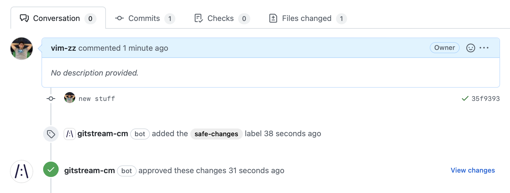
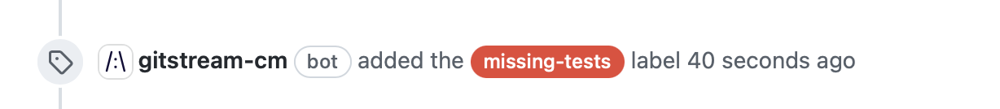
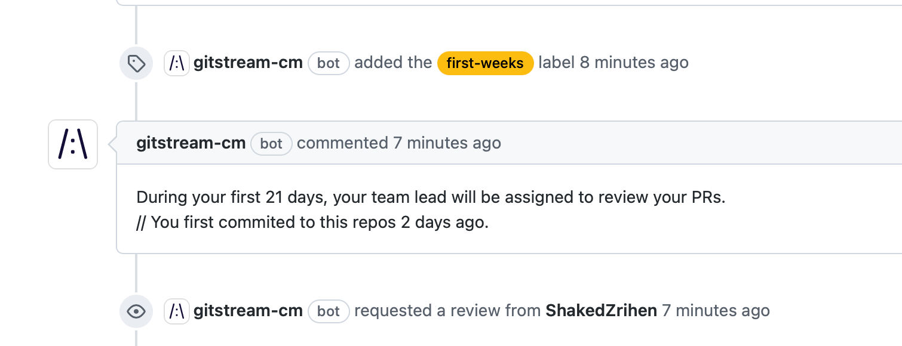
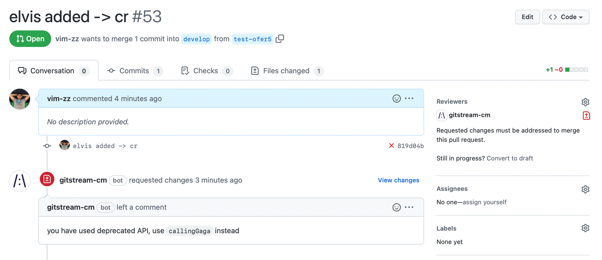

# Examples

Here are some examples of actions that can be applied on repositories by gitStream.

!!! tip 

    See full list on the [gitStream repository](https://github.com/linear-b/gitstream/tree/main/automations).

## Review Efficiency 

### Label PRs by complexity

Automatically add a color-coded label to PRs with the estimated review time.

When used, each PR will be annotated with this label. When there are new commits to the PR, gitStream manage the label and replace it with an updated review time when needed.


```yaml+jinja
automations:
  estimated_time_to_review:
    if:
      - true
    run:
      - action: add-label@v1
        args:
          label: "{{ calc.etr }} min review"
          color: {{ 'E94637' if (calc.etr >= 20) else ('FBBD10' if (calc.etr >= 5) else '36A853') }}

# To simplify the automation, this calculation is placed under a unique YAML key.
# The result is assigned to `calc.etr` which is used in the automation above.
# You can add as many keys as you like.
calc:
  etr: {{ branch | estimatedReviewTime }}
```

<div class="result" markdown>

  <span>
  [:octicons-download-24: Download and add to your repo .cm directory](/downloads/label-prs-by-complexity.cm){ .md-button }
  </span>

</div>

### Approve safe changes  

PRs that include only documentation changes are verified and approved by gitStream. In the example below, marked in yellow, the `files` context is checked by `allDocs` filter that verifies there are only document files. PRs that pass the check are approved by gitStream.



Check out the functions to learn more:

- [`isFormattingChange`](/filter-functions/#isformattingchange)
- [`allDocs`](/filter-functions/#alldocs)
- [`allTests`](/filter-functions/#alltests)

```yaml+jinja
automations:
  safe_changes:
    if:
      - {{ is.formatting or is.docs or is.tests }}
    run: 
      - action: add-label@v1
        args:
          label: 'safe-changes'
      - action: approve@v1

# To simplify the automation, this calculation is placed under a unique YAML key.
# The result is is assigned to `is.formatting`, `is.docs` and `is.tests` which is 
# used in the automation above. You can add as many keys as you like.
is:
  formatting: {{ source.diff.files | isFormattingChange }}
  docs: {{ files | allDocs }}
  tests: {{ files | allTests }}
```

<div class="result" markdown>
  <span>
  [:octicons-download-24: Download and add to your repo .cm directory](/downloads/approve-safe-changes.cm){ .md-button }
  </span>
</div>

## Review Quality

### Like CODEOWNERS but better

With gitStream you can define your sensitive areas, set reviewers, while allowing faster merge time for non-sensitive changes.

The `nope` filter is used to make sure no change is in a sensitive file.

!!! tip

    You can also use regex instead of normal strings, see [here](/filter-functions/#named-arguments)

```yaml+jinja hl_lines="4"
automations:
  approve_non_sensitive:
    if:
      - {{ files | match(list=sensitive) | nope }}
    run: 
      - action: add-label@v1
        args:
          label: 'non-sensitive'
          color: '#2CA44E'
      - action: approve@v1
  require_review:
    if:
      - {{ files | match(list=sensitive) | some }}
    run:
      - action: add-reviewers@v1
        args:
          team_reviewers: ['a-team']
      - action: set-required-approvals@v1
        args:
          approvals: 1

sensitive:
  - src/app/auth/
  - src/app/routing/
  - src/app/resources/
```

<div class="result" markdown>
  <span>
  [:octicons-download-24: Download and add to your repo .cm directory](/downloads/define-sensitive-code-areas.cm){ .md-button }
  </span>
</div>


### Assign the relevant reviewers to PRs

Not every review is equal, getting the right one is important to get high quality feedback. Using `rankByGitBlame` or `rankByGitActivity` makes this data driven. 

For example here, when using `rankByGitBlame` and setting `gt` to 25 which stands for the {==greater-than sign==}: `>`, only those who contributed **more** than 25% of lines overall are selected. Applying `random` will choose one from the list. 

```yaml+jinja hl_lines="8"
automations:
  the_right_reviewer:
    if: 
      - true
    run:
      - action: add-comment@v1
        args:
          comment: |
            {{ repo | explainRankByGitBlame(gt=25) }}
      - action: add-reviewers@v1
        args:
          reviewers: {{ repo | rankByGitBlame(gt=25) | random }}
```

<div class="result" markdown>
  <span>
  [:octicons-download-24: Download and add to your repo .cm directory](/downloads/assign-the-relevant-reviewers-to-prs.cm){ .md-button }
  </span>
</div>

Using `explainRankByGitBlame` shows the resulting data in the PR comment.


### Mark PRs without tests

PRs that don't have tests changes can be marked automatically.

When a PR is opened without any tests, this label is added:



Once the tests are added and committed, gitStream automatically removes the label:


```yaml+jinja hl_lines="4"
automations:
  no_tests:
    if:
      - {{ files | match(regex=r/(test|spec)/) | nope }}
    run: 
      - action: add-label@v1
        args:
          label: 'missing-tests'
          color: '#E94637'
```

<div class="result" markdown>
  <span>
  [:octicons-download-24: Download and add to your repo .cm directory](/downloads/mark-prs-without-tests.cm){ .md-button }
  </span>
</div>

### Require 2 approvals for complex PRs

Automatically require 2 reviewers for PRs that have more than 100 lines of code changed under the `src` directory.

This ability can be very useful if you want to have more approvals for certain PRs, but rather than increasing the required approvals for all PRs using GitHub repo settings, it allows doing that only for specific PRs.


Multiple conditions in the `if` section has AND relationship and must all be true for the automation to execute.

```yaml+jinja hl_lines="4-6"
automations:
  double_review:
    if:
      - {{ branch | estimatedReviewTime >= 30 }}
      - {{ files | length >= 10 }}
      - {{ files | match(regex=r/src\//) | some }}
    run:
      - action: set-required-approvals@v1
        args:
          approvals: 2
```

<div class="result" markdown>
  <span>
  [:octicons-download-24: Download and add to your repo .cm directory](/downloads/more-approvals-for-complex-changes.cm){ .md-button }
  </span>
</div>

!!! note

    gitStream should be set as required check in the repo so it can block merge


### Share knowledge

When setting `lt` to 50, which stands for the {==less-than sign==}: `<`, only those who contributed **less** than 50% of lines overall are selected. Applying `random` will pick one from the list.

```yaml+jinja hl_lines="8"
automations:
  share_knowledge:
    if:
      - true
    run:
      - action: add-reviewers@v1
        args:
          reviewers: {{ repo | rankByGitBlame(lt=50) | random }}
```

<div class="result" markdown>
  <span>
  [:octicons-download-24: Download and add to your repo .cm directory](/downloads/assigning-non-contributors-to-prs.cm){ .md-button }
  </span>
</div>


### Mark PRs with deleted files

When files are removed entirely you want to be sure it is not by accident, mark these PRs.


```yaml+jinja
automations:
  deleted:
    if:
      - {{ has.deleted_files }}
    run: 
      - action: add-label@v1
        args:
          label: 'deleted-files'
          color: '#DF9C04'

has:
  deleted_files: {{ source.diff.files | map(attr='new_file') | match(term='/dev/null') | some }}
```

<div class="result" markdown>
  <span>
  [:octicons-download-24: Download and add to your repo .cm directory](/downloads/mark-prs-with-deleted-files.cm){ .md-button }
  </span>
</div>


## Review Policy


### Close PRs when touching out-of-scope files

This action, once triggered, close the PR without merging.

You can also replace `close` with `requested-changes` to leave the PR open but request to undo the UI changes.


```yaml+jinja
automations:
  close_ui_changes_by_non_ui:
    if:
      - {{ files | match(regex=r/src\/views/) | some }}
      - {{ pr.author_teams | match(term='ui-team') | nope }}
    run:
      - action: add-comment@v1
        args: 
          comment: |
            Please contact a member of `ui-team` team if you need to make changes to files in `src/views`
      - action: close@v1
```

<div class="result" markdown>
  <span>
  [:octicons-download-24: Download and add to your repo .cm directory](/downloads/close-prs-based-on-team-membership.cm){ .md-button }
  </span>
</div>


### Assign mentors to new contributors 

During the first 21 days, a contributor is assigned automatically to get reviews by specific people. By changing `21` you can add or reduce the amount of time.

Make sure to change the reviewers according to your team members.



```yaml+jinja
automations:
  junior:
    if:
      - {{ repo.author_age < 21 and (repo.age - repo.author_age) >= 21 }}
    run:
      - action: add-label@v1
        args:
          label: 'first-weeks'
          color: '#FBBD10'
      - action : add-comment@v1
        args:
          comment: |
            During your first 21 days, your team lead will be assigned to review your PRs.
      - action: add-reviewers@v1
        args:
          reviewers: [popeye]
```

<div class="result" markdown>
  <span>
  [:octicons-download-24: Download and add to your repo .cm directory](/downloads/assign-mentors-to-new-contributors.cm){ .md-button }
  </span>
</div>


### Request changes on deprecated APIs

For example, assume we have an old API `callElvis` we want to switch from to a new API `callGaga`, gitStream can review and trigger a change request automatically when the PR includes use of the deprecated API.

This pattern allows defining best practices in `.cm` code. 



```yaml+jinja
automations:
  catch_deprecated_components:
    if:
      - {{ source.diff.files | matchDiffLines(regex=r/callElvis/) | some }}
    run:
      - action: add-label@v1
        args:
          label: 'deprecated-component'
          color: '#FF0000'
      - action: request-changes@v1
        args:
          comment: |
            you have used deprecated API, use `callingGaga` instead
```

gitStream supports iterators over arrays and dictionaries, so you can also make it more general:

```yaml+jinja hl_lines="2 16 19"
automations:
  
  # Automation names should be unique, therefore the iteration number postfix
  catch_deprecated_components_{{ loop.index }}:
    if:
      - {{ source.diff.files | matchDiffLines(regex=item.regex) | some }}
    run:
      - action: add-label@v1
        args:
          label: 'deprecated-component'
          color: '#FF0000'
      - action: request-changes@v1
        args:
          comment: |
            `{{ item.old }}` component is deprecated, use `{{ item.new }}` instead
  

# This list includes the deprecated items
deprecated:
  - regex: r/callElvis/
    old: Elvis
    new: Gaga
  - regex: r/callOldAPI/
    old: callOldAPI
    new: callBetterAPI
```

<div class="result" markdown>
  <span>
  [:octicons-download-24: Download and add to your repo .cm directory](/downloads/request-changes-on-deprecated-apis.cm){ .md-button }
  </span>
</div>

## More examples

More examples can be found in the [gitStream repository](https://github.com/linear-b/gitstream/tree/main/automations).

!!! tip

    You can boost your GitHub reputation with your new automation rule - open a PR and add it to the [gitStream repository](https://github.com/linear-b/gitstream/tree/main/automations)
