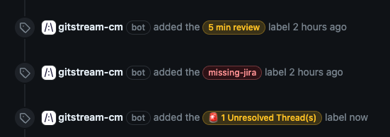

# gitStream Quickstart

This page contains common gitStream configurations that are a great place to begin adopting a continuous merge mindset with gitStream. If you haven't already, you'll need to install gitStream to your [GitHub](github-installation.md) or [GitLab](gitlab-installation.md) organization before you can use these automations

!!! tip "Build your first gitStream automation in as little as two minutes."
    These example are complete gitStream configuration files that you can download directly via the buttons below the examples and upload to the `.cm` directory of your repo. Alternatively, you can copy and paste the individual automations, but make sure you include all required declarations and any related custom expressions from the configuration to ensure everything works properly. 

## Improve PR Context with Label Automation

This CM automation contains a collection of workflows to automatically apply labels that to provide deeper context to code reviewers to help them more quickly triage and address incoming requests for reviews. Ideally, you should implement these automations across your entire git organization to maximize developer usage. 

The following example includes workflow automations to do the following:

* Apply color-coded labels that [estimate how long it takes to review the PR](automations/provide-estimated-time-to-review/README.md).
* Flag PRs that lack required references to [Jira tickets](automations/integrations/jira/label-missing-jira-info/README.md). Check out the gitStream integrations page for more examples of [third-party project management tools](](integrations/README.md)) gitStream integrates with.
* Label PRs that have [unresolved change requests](automations/standard/label-management/label-unresolved-threads/README.md), or [delete code](automations/label-deleted-files/README.md).



!!! example "Label Management with gitStream"
    ```yaml+jinja
    --8<-- "docs/downloads/automation-library/standard/label_automation.cm"
    ```
    <div class="result" markdown>
      <span>
      [:octicons-download-24: Download this example as a CM file.](/downloads/automation-library/standard/label_automation.cm){ .md-button }
      </span>
    </div>


## Automatically Route PR Reviews

The following example includes workflow automations to do the following:

* Recommend the most knowledgeable [code experts](automations/standard/explain-code-experts/README.md) to review the PR.
* Automatically [approve low-risk PRs](automations/approve-safe-changes/README.md) to docs, testing, or code formatting.
* Define criteria for when [PRs need one or more reviews](automations/additional-review-for-large-pr/README.md).
* Label PRs that are available to be cherry picked to merge into the next release.


!!! example "Review Routing with gitStream"
    ```yaml+jinja
    --8<-- "docs/downloads/automation-library/standard/review_routing.cm"
    ```
    <div class="result" markdown>
      <span>
      [:octicons-download-24: Download this example as a CM file.](/downloads/automation-library/standard/review_routing.cm){ .md-button }
      </span>
    </div>

## Next Step

For a more detailed list of automations, check out the gitStream [integrations page](integrations/README.md) or [automation library](automations/automation-library.md).