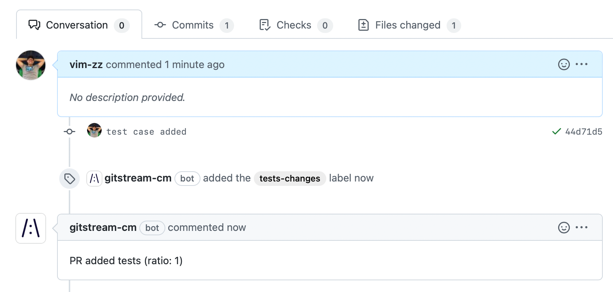

# Examples

Here are some examples of actions that can be applied on repositories by gitStream.

## Label PRs by complexity

Automatically add a color-coded label to PRs with the estimated review time

```yaml+jinja
automations:
  estimated_time_to_review:
    if:
      - true
    run:
      - action: add-label@v1
        args:
          label: "{{ calc.etr }} min review"
          color: {{ 'E94637' if (calc.etr >= 20) else ('FBBD10' if (calc.etr >= 5) else '36A853') }}

# To simplify the automation, this calculation is placed under a unique YAML key.
# The result is is assigned to `calc.etr` which is used in the automation above.
# You can add as many keys as you like.
calc:
  etr: {{ branch | estimatedReviewTime }}
```

<div class="result" markdown>
  <span>
  [:octicons-download-24: Download](downloads/label-prs-by-complexity.cm){ .md-button }
  </span>
  <span class="extra"> and add to your repo .cm directroy</span>
</div>

When used, each PR will be annotated with this label. When there are new commits to the PR, gitStream manage the label and replace it with an updated review time when needed.


## Assign reviewers by type of change

Automatically assign code owners to review certain changes based on file types.

```yaml+jinja
automations:
  review_ui:
    if:
      - {{ files | match(regex=r/src\/ui\/.*\.js$/) | some}}
    run:
      - action: add-reviewers@v1
        args:
          reviewers: [popeye, olive]
```

<div class="result" markdown>
  <span>
  [:octicons-download-24: Download](downloads/assign-reviewers-by-type-of-change.cm){ .md-button }
  </span>
  <span class="extra"> and add to your repo .cm directroy</span>
</div>

Use this when you want to assign a list of reviewers based to a PR automatically. When using [`add-reviewers`](../automation-actions#add-reviewers) the approval is optional, another option is to use [`require-reviewers`](../automation-actions#require-reviewers) instead of so the approval by this user is mandatory.


## Approve safe changes  

PRs that include only documentation changes are verified and approved by gitStream. In the example below, marked in yellow, the `files` context is checked by `allDocs` filter that verifies there are only document files. PRs that pass the check are approved by gitStream.

```yaml+jinja hl_lines="4"
automations:
  safe_changes:
    if:
      - {{ is.formatting or is.docs or is.tests }}
    run: 
      - action: add-label@v1
        args:
          label: 'safe-changes'
      - action: approve@v1

# To simplify the automation, this calculation is placed under a unique YAML key.
# The result is is assigned to `is.formatting`, `is.docs` and `is.tests` which is 
# used in the automation above. You can add as many keys as you like.
is:
  formatting: {{ source.diff.files | isFormattingChange }}
  docs: {{ files | allDocs }}
  tests: {{ files | allTests }}
```

<div class="result" markdown>
  <span>
  [:octicons-download-24: Download](downloads/approve-safe-changes.cm){ .md-button }
  </span>
  <span class="extra"> and add to your repo .cm directroy</span>
</div>


## Mark PRs without tests

PRs that don't have tests changes can be marked automatically.

```yaml+jinja hl_lines="4"
automations:
  no_tests:
    if:
      - {{ files | match(regex=r/(test|spec)/) | nope }}
    run: 
      - action: add-label@v1
        args:
          label: 'missing-tests'
          color: '#E94637'
```

<div class="result" markdown>
  <span>
  [:octicons-download-24: Download](downloads/mark-prs-without-tests.cm){ .md-button }
  </span>
  <span class="extra"> and add to your repo .cm directroy</span>
</div>

When a PR is opened without any tests, this label is added:


Once the tests are added and committed, gitStream automatically removes the label:


## More approvals for complex changes 

Automatically require 2 reviewers for PRs that have more than 100 lines of code changed under the `src` directory.

This ability can be very useful if you want to have more approvals for certain PRs, but rather than increasing the required approvals for all PRs using GitHub repo settings, it allows to do that only for specific PRs.

```yaml+jinja
automations:
  double_review:
    if:
      - {{ branch | estimatedReviewTime >= 30 }}
      - {{ files | length >= 10 }}
      - {{ files | match(regex=r/src\//') | some }}
    run:
      - action: set-required-approvals@v1
        args:
          approvals: 2
```

<div class="result" markdown>
  <span>
  [:octicons-download-24: Download](downloads/more-approvals-for-complex-changes.cm){ .md-button }
  </span>
  <span class="extra"> and add to your repo .cm directroy</span>
</div>

## Validate formatting changes only for JavaScript/TypeScript

For PRs that include only code format change, approve merge automatically. The automation includes 2 actions that both are executed, one after another, when all conditions pass.

```yaml+jinja hl_lines="7-8"
automations:
  allow_formatting:
    if:
      - {{ files | extensions | match(list=['js', 'ts']) | every }}
      - {{ source.diff.files | isFormattingChange }}
    run:
      - action: approve@v1
      - action: add-label@v1
        args:
          label: code-formatting
```

<div class="result" markdown>
  <span>
  [:octicons-download-24: Download](downloads/validate-formatting-changes-for-js-ts.cm){ .md-button }
  </span>
  <span class="extra"> and add to your repo .cm directroy</span>
</div>

!!! note

    Multiple actions can be listed in a single automation. The actions are invoked one by one.
    
    Multiple conditions can be listed for a single automation. All listed conditions must pass to trigger the actions.


## Request changes on deprecated APIs

For example, assume we have an old API `callElvis` we want to switch from to a new API `callGaga`, gitStream can review and trigger a change request automatically when the PR includes use of the deprecated API.

```yaml+jinja
automations:
  
  # Automation names should be unique, therefore the iteration number postfix
  catch_deprecated_components_{{ loop.index }}:
    if:
      - {{ source.diff.files | matchDiffLines(regex=item.regex) | some }}
    run:
      - action: add-label@v1
        args:
          label: 'deprecated-component'
          color: '#FF0000'
      - action: request-changes@v1
        args:
          comment: |
            `{{ item.old }}` component is deprecated, use `{{ item.new }}` instead
  

# This list includes the deprecated items
deprecated:
  - regex: r/callElvis/
    old: Elvis
    new: Gaga
  - regex: r/callOldAPI/
    old: callOldAPI
    new: callBetterAPI
```

<div class="result" markdown>
  <span>
  [:octicons-download-24: Download](downloads/request-changes-on-deprecated-apis.cm){ .md-button }
  </span>
  <span class="extra"> and add to your repo .cm directroy</span>
</div>

This pattern allows to define best practices in `.cm` code. 


## Approve additions to tests

You can use map to check that a PR was about adding more tests.

```yaml+jinja hl_lines="23 25"
automations:
  tests_safe_changes:
    if:
      # Given the PR files changes, check that only tests were changed. The allTests filter checks for 
      # the substring `test` or `spec` in the file path or file name.
      - {{ files | allTests }}
      # Checking `changes.ratio` which is calculated below
      - {{ changes.ratio > 0.8 }}
    run: 
      - action: add-label@v1
        args:
          label: 'tests-changes'
      - action: add-comment@v1
        args:
          comment: |
            PR added tests (ratio: {{ changes.ratio }})
      # - action: approve@v1

# You can add more sections to the .cm file to place more logic, and use it in your automations
# The following logic `ratio` result is used in the automation above by checking `changes.ratio`
changes:
  # Sum all the line added/edited in the PR
  additions: {{ branch.diff.files_metadata | map(attr='additions') | sum }}
  # Sum all the line removed in the PR
  deletions: {{ branch.diff.files_metadata | map(attr='deletions') | sum }}
  # Calculate the ratio to check if it is about new code
  ratio: {{ changes.additions / (changes.additions + changes.deletions) }}
```

<div class="result" markdown>
  <span>
  [:octicons-download-24: Download](downloads/approve-additions-to-tests.cm){ .md-button }
  </span>
  <span class="extra"> and add to your repo .cm directroy</span>
</div>

As a result, if you add test cases to your repo, gitStream can automatically check that and approve the PR automatically.



## Approve changes to prints

When you just want to change the way to print to screen, you can get it approved as long as you didn't change anything else.

```yaml+jinja
automations:
  # for JavaScript
  prints_changes_in_js:
    if: 
      - {{ files | match(regex=r/\.js$|\.ts$/) | every }}
      - {{ files | length == 1 }}
      - {{ source.diff.files | matchDiffLines(regex=r/^[+-].*console\.log/, ignoreWhiteSpaces=true) | every }}
    run: 
      - action: add-label@v1
        args:
          label: 'prints-changes'
      - action: approve@v1

  # for Python
  prints_changes_in_py:
    if: 
      - {{ files | match(regex=r/\.py$/) | every }}
      - {{ files | length == 1 }}
      - {{ source.diff.files | matchDiffLines(regex=r/^[+-].*logger\.(trace|debug|info|warn|error)/, ignoreWhiteSpaces=true) | every }}
    run: 
      - action: add-label@v1
        args:
          label: 'prints-changes'
      - action: approve@v1
```

<div class="result" markdown>
  <span>
  [:octicons-download-24: Download](downloads/approve-changes-to-prints.cm){ .md-button }
  </span>
  <span class="extra"> and add to your repo .cm directroy</span>
</div>

## Assign mentors to new contributors 

During the first 21 days, a contributor is assigned automatically to get reviews by specific people. By changing `21` you can add or reduce the amount of time.

```yaml+jinja hl_lines="3 15"
automations:
  junior:
    if:
      - {{ repo.author_age < 21 and (repo.age - repo.author_age) >= 21 }}
    run:
      - action: add-label@v1
        args:
          label: 'first-weeks'
          color: '#FBBD10'
      - action : add-comment@v1
        args:
          comment: |
            During your first 21 days, your team lead will be assigned to review your PRs.
      - action: add-reviewers@v1
        args:
          reviewers: [popeye]
```

<div class="result" markdown>
  <span>
  [:octicons-download-24: Download](downloads/assign-mentors-to-new-contributors.cm){ .md-button }
  </span>
  <span class="extra"> and add to your repo .cm directroy</span>
</div>

Make sure to change the reviewers according to your team members.


## Assign the relevant reviewers to PRs

```yaml+jinja hl_lines="8"
automations:
  assign_contributor:
   if:
     - true
   run:
     - action: add-reviewers@v1
       args:
         reviewers: {{ repo | rankByGitBlame(gt=50) | random }}
```

<div class="result" markdown>
  <span>
  [:octicons-download-24: Download](downloads/assign-the-relevant-reviewers-to-prs.cm){ .md-button }
  </span>
  <span class="extra"> and add to your repo .cm directroy</span>
</div>

When setting `gt` to 50, only those who contributed **more** than 50% of lines overall are selected. Applying `random` will choose one from the list.

## Share knowledge by assigning non-contributors to PRs

```yaml+jinja hl_lines="8"
automations:
  share_knowledge:
    if:
      - true
    run:
      - action: add-reviewers@v1
        args:
          reviewers: {{ repo | rankByGitBlame(lt=50) | random }}
```

<div class="result" markdown>
  <span>
  [:octicons-download-24: Download](downloads/assigning-non-contributors-to-prs.cm){ .md-button }
  </span>
  <span class="extra"> and add to your repo .cm directroy</span>
</div>

When setting `lt` to 50, only those who contributed **less** than 50% of lines overall are selected. Applying `random` will pick one from the list.

## Assign team to PRs by their member

Assign PR reviewer based on the owner team membership.

```yaml+jinja hl_lines="8"
automations:
  add_first_team_reviewer:
    if:
      - true
    run:
      - action: add-reviewers@v1
        args:
          team_reviewers: {{ pr.author_teams | first }}
```

<div class="result" markdown>
  <span>
  [:octicons-download-24: Download](downloads/assign-team-to-prs-by-their-member.cm){ .md-button }
  </span>
  <span class="extra"> and add to your repo .cm directroy</span>
</div>

You can also omit the `| first` filter to assign all teams the owner is member of.

## Close PRs when touching out-of-scope files

This action, once triggered, close the PR without merging.

```yaml+jinja
automations:
  close_ui_changes_by_non_ui:
    if:
      - {{ files | match(regex=r/src\/views/) | some }}
      - {{ pr.author_teams | match(term='ui-team') | nope }}
    run:
      - action: add-comment@v1
        args: 
          comment: |
            Please contact a member of `ui-team` team if you need to make changes to files in `src/views`
      - action: close@v1
```

<div class="result" markdown>
  <span>
  [:octicons-download-24: Download](downloads/close-prs-based-on-team-membership.cm){ .md-button }
  </span>
  <span class="extra"> and add to your repo .cm directroy</span>
</div>

You can also replace `close` with `requested-changes` to leave the PR open but request to undo the UI changes.
