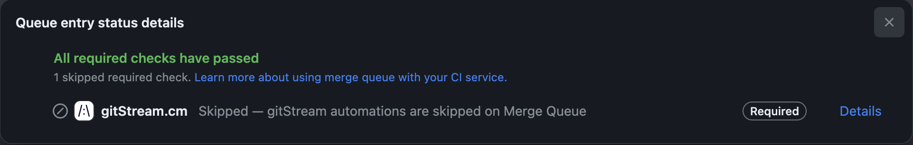

# FAQ

## What permissions are needed?

In your repo permissions, make sure GitHub actions are permitted:

Go to Repo's settings > Actions > General > Actions permissions

Choose which repositories are permitted to use GitHub Actions.

[x] Allow all actions and reusable workflows

## Does gitStream services have access to my code?

Like any other CI/CD automation, the source code is being scanned in the repo and is not shared with any external services. Only metadata that relates and affects the workflow is shared to allow rule based automation on the repo.

## Why does gitStream require permission to write code?
In order to support automations that either Approve or Merge PRs, GitHub API requires code write scope.

## What repos are supported?

Any repo in GitHub is supported. More Git providers are planned soon.

## Can I use gitStream with Merge Queues?

Yes. When a merge queue is used, and gitStream is set as a required check, gitStream automation will be invoked with the merge event. The automation will set gitStream to a `Completed` status and `Skipped` conclusion to allow the PR merge.


## Custom filter functions 

Coming soon.

## Is there .cm syntax highlighting?

The `.cm` file use YAML with JINJA2, in order for your favorite editor to choose automatically the right syntax, you can use modelines.

Add the following line to the top of the `.cm` file (the default has it already): 

```
# -*- mode: yaml -*-
```

Get a plug-in that enable modelines, popular ones are:

- VS Code: [Modelines](https://marketplace.visualstudio.com/items?itemName=chrislajoie.vscode-modelines)
- Sublime Text: [CM syntax for ST4](https://packagecontrol.io/packages/Continuous%20Merge) or [Emacs-like Sublime Modeline](https://github.com/kvs/STEmacsModelines)
- Vim [Modeline magic](https://vim.fandom.com/wiki/Modeline_magic)

## I have an issue I can't seem to solve, what should I do?

Go to our issues page and check if there are any similar issues already reported. If not, create a new issue with all the details so we can take a look.

Found a bug? Create a new item in the [project's issues](https://github.com/linear-b/gitstream/issues)
