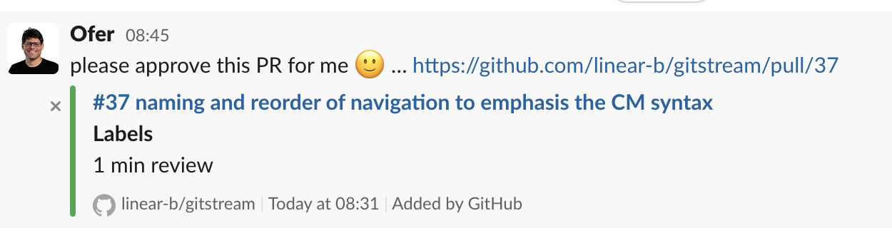
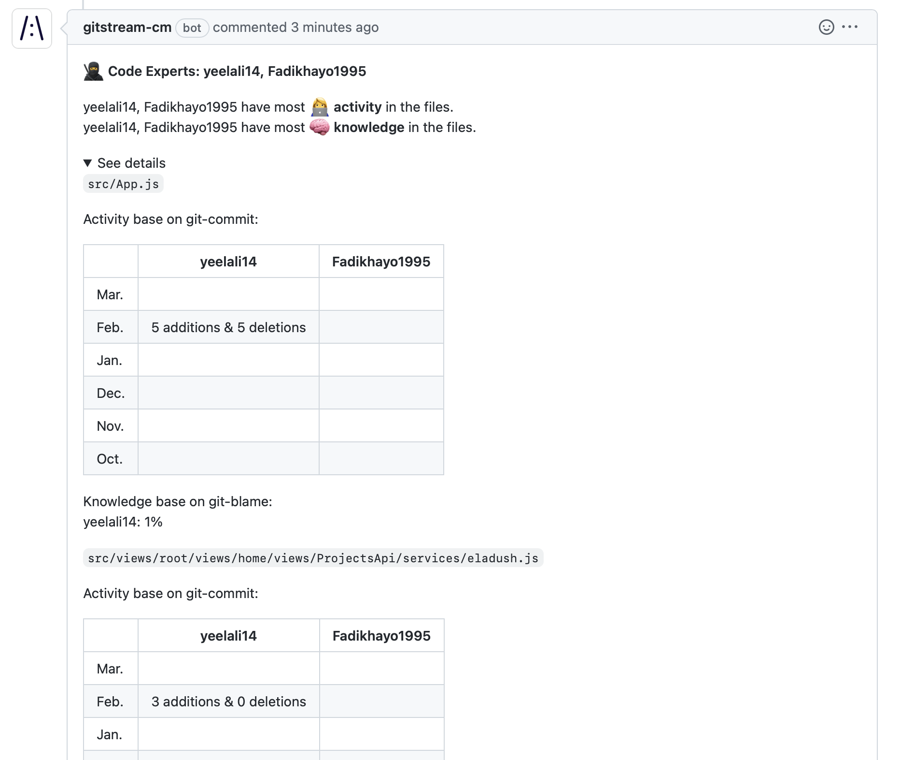

# How to Setup gitStream with GitHub

!!! Warning "Install gitStream"

    Before you can complete the gitStream setup process, you need to install the gitStream app to your [GitHub organization](https://github.com/apps/gitstream-cm/installations/new){ .md-button }.
## Setup
You can set up gitStream for a single repo or your entire GitHub organization. Select the tab below for the instructions you want.
=== "Single Repo"
    **Single Repo Setup**

    You must implement two main components for gitStream to function for a single GitHub repo. The first is a configuration file that defines the workflow automations to execute for the repo. The second is a GitHub actions configuration file that triggers gitStream when PRs are created or updated.
    !!! example "Required Configurations"
        **gitStream**

        Create a `.cm/gitstream.cm` rules file in your repository's default branch (usually `master` or `main`). This file will contain a YAML configuration that determines the workflows that run on the repo, and you can name it anything you want as long as it ends in `.cm`

        Here is an example of a gitStream configuration file you can use to setup some basic workflow automations.

        ```yaml+jinja
        --8<-- "docs/downloads/gitstream.cm"
        ```

        **Github Actions**

        Once your gitStream configuration file is setup, you need a Github Actions configuration file to trigger gitStream automations. Create a `.github/workflows/gitstream.yml` file in your repository's default branch (usually `master` or `main`) and add the following configuration:

        ```yaml+jinja
        --8<-- "docs/downloads/gitstream.yml"
        ```

        !!! Success
            When finished, you should have the following file structure in your repo.

            ```
            .
            ├─ .cm/
            │  └─ gitstream.cm
            ├─ .github/
            │  └─ workflows/
            │     └─ gitstream.yml
            ```

=== "GitHub Organization"
    **GitHub Organization Setup**

    Organization rules are ideal when you want to enforce consistent rules across every repo in your organization. You can define them by creating a special repository named `cm` in your GitHub organization where you can add automation files that will apply to **all** repositories within that organization.

    !!! Tip "Prerequisite: Create a cm repo and enable gitStream."
        Organization-wide automations need to be defined in a repo named "cm" inside your GitHub organization. Before continuing, you must create this repo and <a href="https://github.com/apps/gitstream-cm/installations/new" target="_blank">enable the gitStream app for it</a>.

    !!! example "Required Configurations"
        **gitStream**

        Create a `gitstream.cm` rules file in the root directory of your cm repository's default branch (usually `master` or `main`). This file will contain a YAML configuration that determines the workflows that run on your organization's repos. You can name it anything you want as long as it ends in `.cm`

        !!! info "Configuration files go in the repo's root directory."
            Unlike the set up instructions for a single repo, your `.cm` files should be placed in the repository's root directory.
        ```yaml+jinja
        --8<-- "docs/downloads/gitstream.cm"
        ```
        **GitHub Actions**

        Once your gitStream configuration file is set up, you will need to create a Github Actions configuration file to trigger gitStream automations. Create a `.github/workflows/gitstream.yml` file in your `cm` repository's default branch (usually `master` or `main`) and add the following configuration:

        ```yaml+jinja
        --8<-- "docs/downloads/gitstream.yml"
        ```

        !!! Success
            Once finished, **all** PRs to your organization's repositories will be processed by the GitHub Action in this repo, and your `cm` repo should have a file directory that looks like this.

            ```
            .
            ├─ gitstream.cm
            ├─ .github/
            │  └─ workflows/
            │     └─ gitstream.yml
            ```

!!! info "gitStream will now do these two things."
        When a PR is created or changed, apply or update a label that provides an estimated time to review.
        
        

        When a new PR is created, comment with a list of code experts.
        
## Next Step
!!! tip "How gitStream Works"
        Read our guide: [How gitStream Works](/how-it-works/) to get an overview of the gitStream syntax and automation lifecycle.
## Additional Resources

### Required GitHub Permissions

| Permissions           | Reason |
|----------------------|-------------------------------------------------------|
| Write access to dedicated gitStream app files | Used to set up the gitStream workflow files |
| Write access to code | To allow gitStream to approve PRs once all conditions are met |
| Read access to administration, issues, and metadata | To get the user team membership, and branch protection settings |
| Read and write access to actions, checks, pull requests, and workflows | Trigger workflows, create and update pull requests and their checks, and modify workflow files |
| User email | Used to identify users |

### Configure gitStream to Block Merges <a name="github-merge-block"></a>
You can configure Github to require gitStream checks to pass before PRs can be merged using [branch protection rules](https://docs.github.com/en/repositories/configuring-branches-and-merges-in-your-repository/defining-the-mergeability-of-pull-requests/about-protected-branches).

!!! info "Run a gitStream check before continuing"
    You need to run a check using your gitStream configuration at least once before it can be set as a required check. Make sure to open at least 1 PR before doing this setting.

Here are the steps to configure gitStream in your repo's branch protection rules.

1. Go to repo `settings`
2. On the left panel select `Code and automation` > `Branches`
3. Set `Branch protection rules` for your desired branch
4. Enable `Require status checks to pass before merging`
5. Search for `status checks in the last week for this repository`
6. Select `gitStream.cm` as required check


### Configuring gitStream with Self-Hosted Runners

To ensure gitStream runs on self-hosted GitHub Actions runners, follow these steps to configure it:

1. **Configure Self-Hosted Runners with **
    Ensure you have self-hosted runners set up for your GitHub organization or repository. Refer to the GitHub documentation on [self-hosted runners](https://docs.github.com/en/actions/hosting-your-own-runners) and [Using self-hosted runners in a workflow](https://docs.github.com/en/actions/hosting-your-own-runners/managing-self-hosted-runners/using-self-hosted-runners-in-a-workflow) for detailed instructions.
    
1. **Install Docker and Git on Self-Hosted Runners**
	Make sure your self-hosted runners have Docker and Git installed. These are essential dependencies for gitStream to function properly. You can follow the official installation guides for [Docker](https://docs.docker.com/get-docker/) and [Git](https://git-scm.com/book/en/v2/Getting-Started-Installing-Git).

2. **Update GitHub Actions Configuration**
    Open the gitStream GitHub Actions workflow file (`.github/workflows/gitstream.yml`) and update the `runs-on` field to specify that the gitStream job must run on self-hosted runners. For example:

    ```yaml
    jobs:
      gitStream:
        runs-on: self-hosted
        # ... other configuration ...
    ```

3. **Save and Commit**
    Save your changes to the workflow file and commit them to your repository.

4. **Test with a Sample PR**
    Create a sample pull request and observe gitStream's behavior. It will use the configured self-hosted runners.
## Uninstalling gitStream

Configure in your [GitHub organization](https://github.com/apps/gitstream-cm/installations/new){ .md-button }, and choose `Uninstall "gitStream.cm"`
