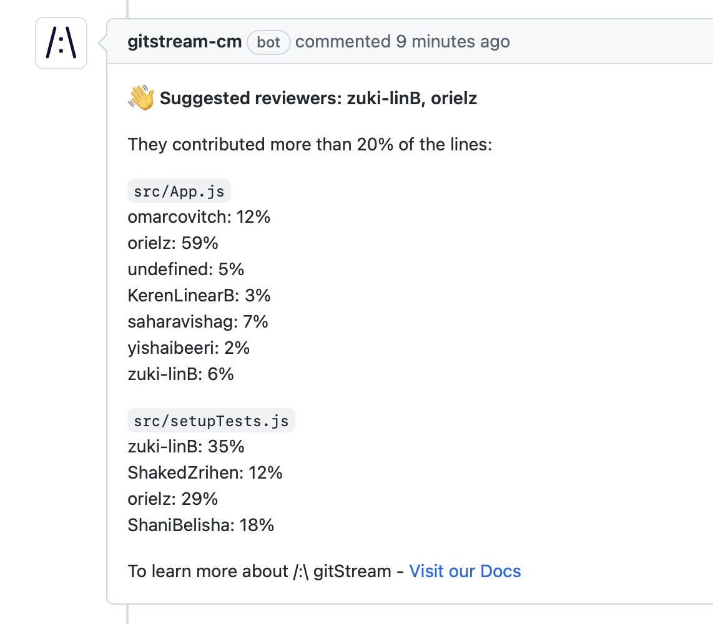

# How to Setup gitStream with GitLab

!!! info "Prerequisites"

    1. GitLab cloud
    1. GitLab runner v15 or higher

!!! tip

	gitStream automation rules are executed on behalf of the user account used to install it, and this account must have the `Maintainer` role. We recommend creating a new dedicated account (e.g. `gitstream-cm`) in GitLab to install the gitStream app.

## Setup

You can set up gitStream for a single repo or your entire GitLab organization. Select the tab below for the instructions you want.
=== "Single Repo"
    **Single Repo Setup**

    You must implement two main components for gitStream to function for a single GitLab repo. The first is a configuration file that defines the workflow automations to execute for the repo. The second is a GitLab actions configuration file that triggers gitStream when PRs are created or updated which is hosted in a special `cm` repo.

    !!! Warning "Prerequisite: Create a cm repo and enable gitStream."
        Create a `cm` project (repository) in your GitLab group. It should be created in the same group or a parent group of the target repositories

    !!! example "Required Configurations"
        **gitStream**

        Create a `.cm/gitstream.cm` rules file in your repository's default branch (usually `master` or `main`). This file will contain a YAML configuration that determines the workflows that run on the repo, and you can name it anything you want as long as it ends in `.cm`

        Here is an example of a gitStream configuration file you can use to setup some basic workflow automations.

        ```yaml+jinja
        --8<-- "docs/downloads/gitstream.cm"
        ```

        **GitLab CI**

        Once your gitStream configuration file is setup, you need a GitLab CI configuration file to trigger gitStream automations. Create a new `cm` project (repository) in your GitLab group. It should be created in the same group or a parent group of the target repositories. Create a `.gitlab-ci.yml` file in your new `cm` repository's default branch (usually `master` or `main`) and add the following configuration:

        ```yaml+jinja
        --8<-- "docs/downloads/gitlab-ci.yml"
        ```

        !!! Success
            When finished, you should have the following file structure in your `cm` repo.

            ```text
            .
            ├─ .gitlab-ci.yml
            ```

            And in your target repository:

            ```text
            .
            ├─ .cm/
            │  └─ gitstream.cm
            ```

=== "GitLab Group"
    **GitLab Group Setup**

    Organization rules are ideal when you want to enforce consistent rules across every repo in your organization. You can define them by creating a special repository named `cm` in your GitLab organization top group where you can add automation files that will apply to **all** repositories within that organization.

    !!! Warning "Prerequisite: Create a cm repo and enable gitStream."
        Create a `cm` project (repository) in your GitLab group. It should be created in the same group or a parent group of the target repositories

    !!! example "Required Configurations"
        **gitStream**

        Create a `gitstream.cm` rules file in the root directory of your `cm` repository's default branch (usually `master` or `main`). This file will contain a YAML configuration that determines the workflows that run on your organization's repos. You can name it anything you want as long as it ends in `.cm`

        !!! info "Configuration files go in the repo's root directory."
            Unlike the set up instructions for a single repo, your `.cm` files should be placed in the repository's root directory.
        ```yaml+jinja
        --8<-- "docs/downloads/gitstream.cm"
        ```
        **GitLab CI**

        Once your gitStream configuration file is setup, you need a GitLab CI configuration file to trigger gitStream automations. Create a `.gitlab-ci.yml` file in your new `cm` repository's default branch (usually `master` or `main`) and add the following configuration:

        ```yaml+jinja
        --8<-- "docs/downloads/gitlab-ci.yml"
        ```

        !!! Success
            When finished, you should have the following file structure in your `cm` repo.

            ```text
            .
            ├─ .gitlab-ci.yml
            ├─ gitstream.cm
            ```
## Install gitStream App
!!! Warning "Install gitStream"
    The last step of the process is to install the gitStream app to your [GitLab organization](https://api.gitstream.cm/auth/grant/gitlab){ .md-button }.
    
!!! info "gitStream will now do these two things."
        When a PR is created or changed, apply or update a label that provides an estimated time to review.
        

        When a `suggest-reviewers` label is applied to a PR, gitStream will comment with a list of code experts.
        
!!! attention

	When renaming or adding new repositories, you must re-authenticate gitStream in [GitLab](https://api.gitstream.cm/auth/grant/gitlab)
## Next Step
!!! tip "How gitStream Works"
        Read our guide: [How gitStream Works](/how-it-works/) to get an overview of the gitStream syntax and automation lifecycle.

## Additional Resources


### Required GitLab Permissions

The required permissions are:

| Permissions           | Reason |
|----------------------|-------------------------------------------------------|
| Read/Write API | To get notified on MR changes and allow gitStream to approve MRs once all conditions are met |
| Read repository | To read and check rules over the code changes on monitored repositories |
| Read user profile | Used to identify users |

### No support for gitStream to Block Merges
gitStream actions that blocks MR merge are not support at the moment.

### gitStream service account

Automation rules by gitStream are executed on behalf of the user account used to install it. We recommend using a new dedicated account in GitLab for installing gitStream, e.g. `gitstream-cm`

## Uninstalling gitStream

Use the following link to uninstall gitStream app for [GitLab](https://webhooks.gitstream.cm/auth/grant/gitlab?state=uninstall){ .md-button }.

!!! attention

	The uninstalling account has to have at least `Developer` or `Maintainer` role in the Group.
