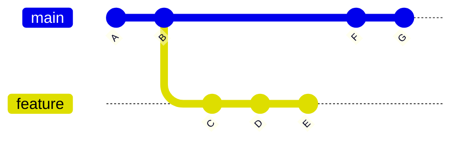
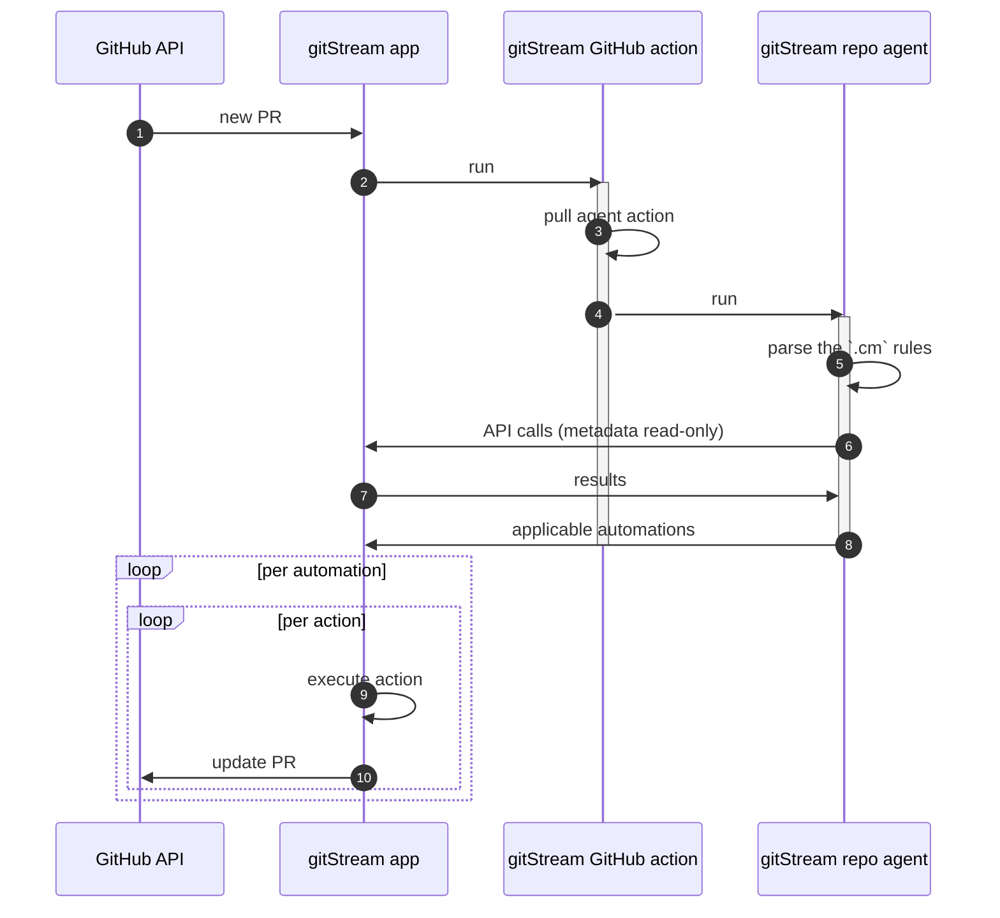
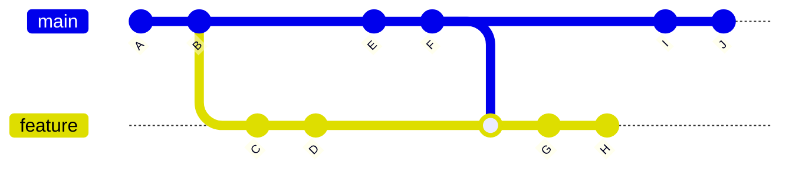

# How it works

Every time a dev opens a new Pull Request or changes a Pull Request, gitStream is triggered. Next, the `.cm` file is used to determine which automatic actions are invoked based on their conditions. The resulting actions use GitHub API to achieve the desired outcome.

The next steps are common practice of changing code in repo:

1. Create a feature branch 
2. Commit changes  
3. Push branch to remote repo 
4. Open Pull Request 

When a new PR is opened, several actors are running:

1. GitHub API
2. gitStream app which you have installed from the marketplace 
3. gitStream **workflows** action that was placed in `.github/workflows/gitstream.yml` and pulls another **agent** action from `linear-b/gitstream-github-action@v1`

Once a new PR is opened (or changed) the following process occurs:

1. gitStream gets event for the new PR 
2. gitStream calls the installed action in `.github/workflows/gitstream.yml`
3. The installed action pulls and runs gitStream action `linear-b/gitstream-github-action@v1`. 
4. This action runs locally in the repo and relies on 
5. The current branch is used to check which automations are valid from `.cm/gitstream.cm`
6. The action calls to gitStream app with metadata
7. gitStream app returns results
8. The list of applicable automations are sent to the gitStream GitHub app
9. gitStream GitHub app iterates over the automations and invokes each action using GitHub APIs
10. The PR gets updated according to the desired automations

At the end, the PR is ready for further review or merge.

The following diagram describes the flow:

## The branch diff

The branch diff is defined as the difference between the current branch and the most recent commit in the main branch, which is shared between both branches.

In the example above, the diff is performed between commits `H` and `F`.

## Automation results

Eventually, the gitStream app shows the following statuses:  

 Success - when the applicable automation finished and PR is good to go 

 Neutral - when there aren't any applicable automations for the PR

 Failed - when the applicable automation finished without completion