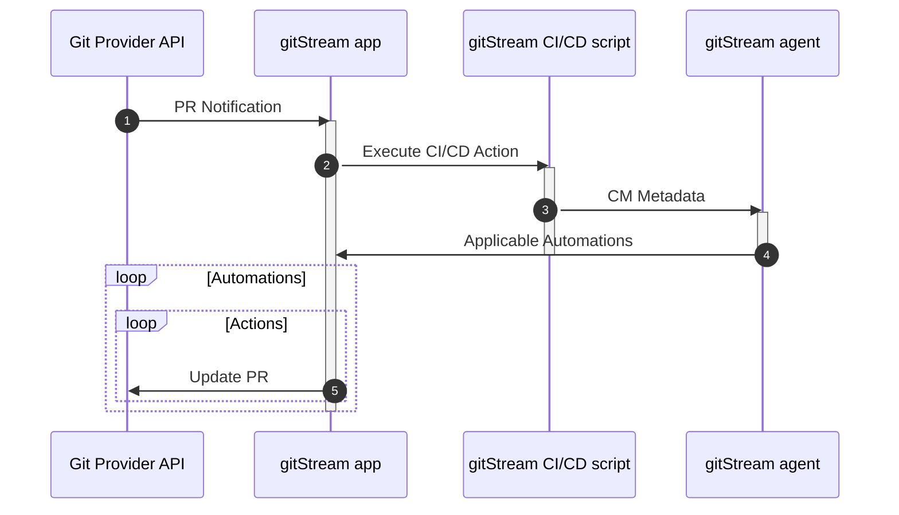

# How gitStream Works
You can configure gitStream via one or more Continuous Merge (CM) files inside your git repository or GitHub/GitLab organization. These files end with a `.cm`  extension, and they outline automations that will run for your repo's pull requests. 
## Syntax Overview
CM files contain a combination of YAML and Jinja2 to build rules that follow an "if this, then that" approach to triggering and executing automations. This, combined with templating and gitStream-specific functions gives you a highly-flexible framework for building custom CM automations.

All CM files must have a section that starts with `automations:` that contains one or more custom automations that will trigger for the repo. By default, gitStream is triggered every time someone opens a new PR or pushes a commit to an existing PR. Once activated, gitStream searches for applicable CM files and executes the automations that are listed inside them.

!!! tip "Explicit Triggers"
    You can configure gitStream to trigger for other PR interactions, including comments, labels, and merge status. Read more about the [gitStream execution model](/execution-model).

Here is an example of the basic components that are required in every CM file.

!!! example "Required CM Components"
    Please note, this is not a valid CM automation, it is only for illustrative purposes.
    ```yaml+jinja
        # -*- mode: yaml -*-
        manifest:
          version: 1.0
        automations:
          my_automation:
            if:
              - # Add a condition here
            run:
              - # Add an automation here
    ```

!!! info
    When editing CM files, make sure you preserve the indentation in the examples because, like YAML, gitStream uses Python-style indentation to indicate nesting.
### Automation Actions
[Automation actions](/automation-actions) define the desired automations triggered when specific conditions are met. Each automation must contain an `if` condition and a `run` section. Conditions are evaluated when a PR is created or modified. Multiple conditions can be listed, but all must be true to trigger the actions.

Any number of actions can be included in a single automation, and these actions are invoked one-by-one in no particular order. PRs marked as Draft are ignored by default, and this behavior can be modified using [explicit triggers](./execution-model.md#explicit-triggers) (GitHub only).

!!! example "Basic Automation Example"
    This example defines an automation named `welcome_newcomer` that post a comment to welcome anyone who submits their first PR to the repo.
    ```yaml+jinja
    automations:
      welcome_newcomer:
        if: 
          - {{ repo.contributors | isFirstCommit(branch.author) }}
        run: 
          - action: add-comment@v1
            args:
              comment: Welcome {{branch.author}}!
    ```
### Context Variables and Filter Functions
[Context variables](/context-variables) are pre-defined objects that gitStream provides as the input data you will need to build your automations. These variables enable you to access information about things like the file names and paths, the person who submitted the PR, or what code was changed.

[Filter functions](/filter-functions) are functions you can call and apply to variables. They are called with a pipe operator `|` and can take arguments inside parentheses `( )`. The logic expressions are based on Jinja2 syntax, supported by the [Nunjucks library](https://mozilla.github.io/nunjucks/templating.html#builtin-filters).

!!! example "Context Variable and Filter Function Example"
    The following statement passes the context variable [`files`](/context-variables/#files) to the filter function [`match`](/filter-functions/#match) which uses an optional list of sensitive filepaths that would need to be defined later in the CM file, and returns true if any of the files match the list as indicated by the [`some`](/filter-functions/#some) filter function.
    ```yaml+jinja
    {{ files | match(list=sensitive) | some }}
    ```

You can also apply <a href="https://mozilla.github.io/nunjucks/templating.html#logic" target="_blank">Nunjucks logic operators</a> to filters
!!! example "Logic Operators Example"
    This example inverts the previous example using the keyword `not`.
    ```yaml+jinja
    {{ not (files | match(list=sensitive) | some )}}
    ```
### Custom Expressions
Jinja templating makes it easy to write custom expressions that can be invoked elsewhere in your CM files. This makes it easy to reuse data, define custom criteria, and keep your configuration files cleaner so they're easier to manage.  

!!! example "Custom Expressions Example"
    This example contains two custom expressions; `is:` contains a context variable and some filter functions that are invoked in the `sensitive_review` automation via `is.sensitive`, and `sensitive directories` contains a list of directory paths that will be matched in the filter function.
    ```yaml+jinja
    automations:
      sensitive_review:
        if:
          - is.sensitive
        run:
          - action: set-required-approvals@v1
            args:
              approvals: 2

    is:
      sensitive: {{ files | match(list=sensitive_directories) | some }}

    sensitive_directories:
      - src/app/auth/
      - src/app/routing/
      - src/app/resources/
    ```

### Built-in Functions
gitStream is built on top of Jinja2 and provides all [default filters](https://mozilla.github.io/nunjucks/templating.html#builtin-filters) from that library. gitStream also includes extra filters on top of Jinja2 that are specific to git repo workflow automations.

!!! warning
    Don't use these terms when naming automations, plugins, custom expressions, or any other component of gitStream because this will lead to naming conflicts

gitStream filters:

`allDocs` `allImages` `allTests` `automations` `codeExperts` `config` `difference` `estimatedReviewTime` `explainCodeExperts` `explainRankByGitBlame` `extractJitFindings` `extractSonarFindings` `extensions` `every` `filter` `includes` `isFirstCommit` `isFormattingChange` `intersection` `manifest` `map` `mapToEnum` `match` `matchDiffLines` `nope` `rankByGitActivity` `rankByGitBlame` `reject` `some`

[Nunjucks](https://mozilla.github.io/nunjucks/templating.html#builtin-filters) filters:

`abs` `asyncAll` `asyncEach` `batch` `block` `call` `capitalize` `center` `default` `dictsort` `dump` `e` `escape` `extends` `filter` `first` `float` `for` `forceescape` `groupby` `if` `import` `include` `indent` `int` `join` `last` `length` `list` `lower` `macro` `nl2br` `raw` `reject` `rejectattr` `replace` `reverse` `round` `safe` `select` `selectattr` `set` `slice` `sort` `string` `striptags` `sum` `title` `trim` `truncate` `upper` `urlencode` `urlize` `verbatim` `wordcount`

### Ignore Files or Repos

You can provide gitStream with a list of specific files to ignore for all automations listed in the same CM file. To do so, add a [`configuration:`](/cm-file/#config) section to the CM file that you want to apply the exclusion list to. In the configuration section, add a list of files as an argument to the `ignore_files:` key.

!!! example "How to Ignore Files"
    To ignore a list of files, add a `config.ignore_files` to you CM file like this: 
    ```yaml+jinja
    config:
      ignore_files:
        - 'yarn.lock'
        - 'package-lock.json'
        - 'openapi.json'
        - 'ui/src/**/*Model.d.ts'
    ```

Similarly, if you are using gitStream for your entire git organization, you can specify repos to ignore in the `gitstream.cm` file in the root directory of your cm repo.

!!! example "How to Ignore Repos"
    ```yaml+jinja
    config:
      ignore_repositories:
        - services
        - common
    ```

### Configuration Priority and Overrides
You can provide any number of CM files and automations for gitStream to process and you can freely combine organization-level automations with automations inside individual repos. There are two important things you need to keep in mind when doing this.

First, when a repository defines the same automation as an organization-level rule, the repository automation will take precedence and override the organization automation. The CM file name and the automation name must both match for this to take effect because gitStream identifies all automations based on a combination of both. For example, if you have a `gitstream.cm` file that contains an automation named `my_automation`, gitStream will identify that as `gitstream/my_automation`.

Second, no priority is given to individual automations. Instead, gitStream collects all applicable automations for a given PR and processes them all at once.

### Plugins

gitStream supports the use of JavaScript plugins to create new filter functions. This enables you to write code that further extends gitStream capabilities and connect gitStream to external API services. Read the guide on writing gitStream

## Next Step
!!! tip "Write your first automation."
    The best way to familiarize yourself with CM syntax is to build automations, and we've covered enough info for you to start! 
    
    If you're ready to start writing automations, check out our guide: [Write Your First Automation](quick-start.md).
## Additional Resources

### gitStream UI
Once you have gitStream installed and have run some automations, you can view details about them at [app.gitstream.cm](https://app.gitstream.cm). To view gitStream data, you will need to login with your GitHub account and have access to an organization that has run gitStream automations.


### Functional Overview

Once gitStream is installed and configured, there are several services that will interact with your repository whenever a PR is created or changed:

* The **git service provider API** (e.g. GitHub, Gitlab)
* The **gitStream service** that was installed from the git service provider marketplace.
* A **gitStream CI/CD script** that is configured for the git service provider (e.g. GitHub Actions, GitLab CI/CD).
* A **gitStream agent** the CI/CD script triggers to execute your automation.

Whenever a new PR is opened or an existing PR is changed, the following process occurs:

1. The **git service provider API** notifies the **gitStream service** that an applicable change has occured to the PR which triggers a call to execute the **gitStream CI/CD script**.
1. The **gitStream CI/CD script** executes the GitHub Action <a href="https://github.com/linear-b/gitstream-github-action" target="_blank">`linear-b/gitstream-github-action@v1`</a> on the repository, which looks for two things:
    * Valid CM files that match the filepath `.cm/*.cm` 
    * Any CM files that are contained in the root directory of the organization's cm repo (if applicable).
1. The **gitStream CI/CD script** passes all CM metadata to the **gitStream agent** which parses a list of all applicable CM rules. 
1. The **GitStream agent** provides the list of applicable automations to the **gitStream service**.
1. The **gitStream service** iterates through the automations and updates the PR via the **git service provider API**.

Here is a diagram that illustrates how things work behind the scenes:

Upon completion, gitStream will show one of the following three statuses:

*  Success - when the applicable automation finished and PR is good to go
*  Neutral - when there aren't any applicable automations for the PR
*  Failed - when the applicable automation finished without completion

gitStream checks have a 10-minute timeout for fail-safe reasons. If the check exceeds this time limit, the result will be displayed as Neutral - *Skipped*.

### Syntax highlighting

You can add support for `.cm` in your code editor, see [FAQ](https://docs.gitstream.cm/faq/#is-there-cm-syntax-highlighting).

## Is something missing?

If you find an issue with these docs or with gitStream itself, please search the  [gitStream issues page](https://github.com/linear-b/gitstream/issues) and create an issue if one doesn't already exist for your problem.
