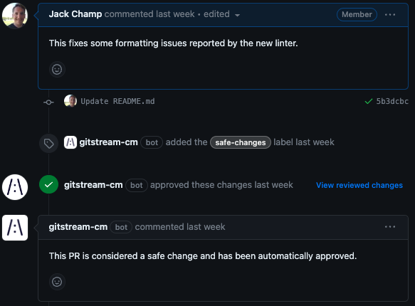

# /:\ gitStream
gitStream is a workflow automation tool that enables you to use YAML configuration files to optimize your code review process. Add context to PRs, find code experts for reviews, and automate the merge process to maximize developer productivity.

**Build Your First Automation in 2 Minutes**
=== ":fontawesome-brands-github: GitHub"

	1. Install gitStream for free in [GitHub](https://github.com/apps/gitstream-cm/installations/new)
	2. Configure your repository using the [instructions for GitHub](github-installation.md). This will guide you through setting up your first automations.

	That's it! Now sit back and watch gitStream run automation rules on your next PR.

	!!! tip "Tip: Install gitStream for your entire organizaton"

		gitStream can be installed for one repo, specific repos, or all repos in your organization. We recommend installing for **all** because it will ensure all new repos are able to use gitStream. You can change this setting at any time in the future.

=== ":fontawesome-brands-gitlab: GitLab"

	Follow the installation instructions for GitLab [here](gitlab-installation.md)

=== ":fontawesome-brands-bitbucket: BitBucket"

	Coming soon

## Features

{: style="width:50%", align=right}

!!! quote ""
	**Auto-Merge PRs**

	Not all PRs need extensive review policies that loop in multiple experts. gitStream lets you auto-merge [safe changes](automations/approve-safe-changes/README.md), [small fixes](automations/approve-tiny-changes/README.md), [PRs from trusted teams](automations/approve-team-by-directory/README.md), and anything else you want to unblock the review process to keep your team focused on their work.

{: style="width:50%", align=left}
!!! quote ""
	**Contextual Labels**

	Reduce the mental burden of code reviews with labels that provide a high degree of context. Indicate an [estimated time to review](automations/provide-estimated-time-to-review/README.md) or flag potential issues with [Jira information](automations/label-missing-jira-info/README.md), [missing tests](automations/label-prs-without-tests/README.md), [deleted files](automations/label-deleted-files/README.md), and more.

{: style="width:50%", align=right}
!!! quote ""
	**Review Assignment**

	Identifying the correct people to review a PR can take time, particularly for complex projects and repos requiring deep expertise. [Assign code experts](automations/assign-code-experts/README.md) to review complex PRs, [notify your security team about sensitive changes](automations/review-sensitive-files/README.md), and automatically [assign reviewers based on the contents of the PR](automations/assign-reviewers-by-directory/README.md).

{: style="width:50%", align=left}
!!! quote ""
	**Automated Change Requests**
	
	Reduce code review noise by catching issues before anyone invests precious time. Flag [deprecated components](automations/change-deprecated-components/README.md), [missing data objects](automations/change-missing-lambda-field/README.md), [off-limits code](automations/close-wrong-team-by-directory/README.md), and other problems that need to be addressed before assigning code reviewers.

**Install /:\ gitStream Now**

[:fontawesome-brands-github: GitHub](https://github.com/apps/gitstream-cm/installations/new){ .md-button }
[:fontawesome-brands-gitlab: GitLab](http://127.0.0.1:8000/gitlab-installation/){ .md-button }

## Get Involved
Want to report a bug, request a new feature, ask a question, get updates for new features, or propose a new configuration for the automation library? [Join us on GitHub](https://github.com/linear-b/gitstream).