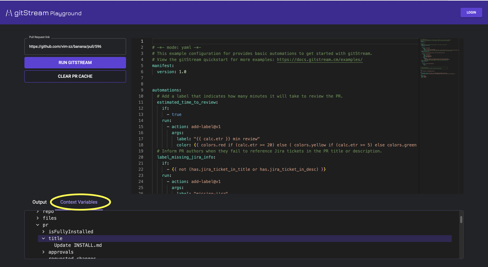

# Plugins Development

## Create Filter Function Plugins

gitStream plugins are based on the [CommonJS](https://en.wikipedia.org/wiki/CommonJS) module standard, a widely used pattern for structuring and importing JavaScript modules.

!!! info "Supported JavaScript Dependencies"
    gitStream supports the following JavaScript dependencies: [axios](https://github.com/axios/axios), github actions core (@actions/core), [moment](https://github.com/moment/moment), [lodash](https://github.com/lodash/lodash), octokit rest api (@octokit/rest)

    No other dependencies are supported at this time. If you have recommendations for new dependencies, please open a new issue on the [gitStream GitHub repo](https://github.com/linear-b/gitstream).

### Define a New Plugin

Each filter function plugin must have its own unique directory inside the appropriate `/filters` directory for your repo or organization. To create a new filter function, create an index.js file inside the plugin's top-level directory, all plugins must have an index.js file that serves as the primary entry point

One of the functions contained inside this file must be exported via `module.exports`, using the following conventions:

Export plugins that use synchronous code:

``` javascript
function myFilter(author) {
    return "Hello ${author}!";
};

module.exports = myFilter;
```

### Define a New Asynchronous Plugin (async)

When using async JavaScript in your plugin, you need two things:

* A primary async function that returns a `callback()` containing any errors as the first argument and the result of the filter as the second.
* A `module.exports` statement that includes the properties `async: true` and `filter: <filterName>` with `<filterName>` matching the primary function that's being exported.

``` javascript
const myFilter = async (author, callback) => {
    const message = { text: "Hello ${author}!" };
    const error = null;
    return callback(error, message.text);
};

module.exports = {
    async: true,
    filter: myFilter
}
```

!!! info "Async Error Handling"
    Errors reported by async plugins are output to the workflow runner logs. E.g. GitHub Actions, GitLab CI, etc.

Here's how to invoke the new filter from this example, whether it's synchronous or asynchronous:

```yaml+jinja
automations:
  welcome_author:
    if:
      - true
    run:
      - action: add-comment@v1
        args:
          comment: {{ pr.author | myFilter }}
```

!!! warning "15 Minute Time Limit"
    gitStream actions are terminated after 15 minutes, this is a hard limit that can't be extended.

#### Using Async Plugin in Conditions

Normally, gitStream optimizes plugin execution by rendering plugins only after condition evaluation when all automation rules are decided. This optimization prevents unnecessary plugin calls.

However, when using an async plugin in a **condition** without the `immediate: true` flag, this optimization causes the plugin to not work properly, and you will see warning messages in the logs.

To use an async plugin in a condition, you must annotate the plugin with `immediate: true`:

```javascript
module.exports = {
    async: true,
    immediate: true,
    filter: myFilter
}
```

The `immediate: true` flag tells the system not to optimize plugin execution. The downside is that the plugin might be called multiple times during the workflow execution. If your plugin makes API calls, this will result in multiple API requests as well.

```yaml+jinja
automations:
  welcome_author:
    if:
      - {{ "" | myFilter }}
    run:
      - action: add-comment@v1
        args:
          comment: hello world!
```

### Accept Arguments

Filter function plugins can accept any number of arguments. The first argument must be passed to the filter function via a ` | ` operator; all subsequent arguments are passed as a set inside parenthesis.

!!! example "Filter function to combine two strings"

    This example accepts two strings and combines them, separating by a space:

    ```javascript
    function combineStrings(str1, str2) {
      return str1 + " " + str2;
    }
    module.exports = combineStrings;
    ```

    In the following invocation, "Hello" is passed as `str1` and "world!" is passed as `str2`

    `{{ "Hello" | combineStrings("world!") }}`

### Tips for develpers

1. **Debugging with console.log()**

    Any data passed to `console.log()` will be displayed in your workflow runner logs, such as GitHub Actions, GitLab CI, etc.

2. **Context Variable Insight**

    Utilize the [gitStream playground](https://app.gitstream.cm/playground) to see how the context variable appears in a real Pull Request (PR). Inspect the PR Context Variables at the bottom of the screen .

3. **Local Execution**

    - Run the plugin locally for testing, for example: Running `index.js` with Node.js.
      ```javascript
      module.exports = (text) => {
          return text.replaceAll('banana', '🍌');
      };

      const banana = require('./index.js');
      console.assert(banana("hello banana!") === 'hello 🍌!', `banana("hello banana!") === 'hello 🍌!' but got ${banana("hello banana!")}`);
      ```

    - Execute with:
      ```bash
      $ node index.js
      ```

4. **Handling Escaped Characters**

    When returning strings with escaped characters, add an extra slash as it will be parsed by the template engine. For example, to return the following text `"first line \n next line"` you should return this from the plugin `"first line \\n next line"`.

!!! tip "Check out the community plugin library."
    Check out the [filter function plugin library](/filter-function-plugins) to explore plugins created by the LinearB community.

## Contribute to the Community Plugin Library

LinearB maintains a collection of [community-contributed gitStream plugins](/filter-function-plugins). Here are the instructions for publishing a plugin as part of this library.

Create a directory for your plugin inside one of the subdirectories in `plugins/filters`. The name of the directory must match the name of the exported JavaScript function. Then ensure you have all of the required files and JSDoc content outlined below.

Here is an [example of a well-designed gitStream plugin](https://github.com/linear-b/gitstream/tree/main/plugins/filters/isFlaggedUser).

Required Files:

* index.js - The entry point for your plugin. This should have a main function that is exported via `module.exports` that is documented according to the JSDoc requirements outlined below.
* README.md - Use this [template](https://github.com/linear-b/gitstream/tree/main/docs/templates/filter-readme-template.md).
* reference.md - This file must be auto-generated by `jsdoc2md`, see the instructions below.
* plugin_name.cm - A gitStream CM example that uses the plugin.
* LICENSE - The full text of the open source license the code is provided under.

Required JSDoc tags:

* `@module` - This must match the name of the exported JavaScript function.
* `@description` - A 1-2 line description that wholistically describes the functionality of the plugin.
* `@param` - There should be one `@param` tag for each argument the plugin accepts, with indicated types. Indicate which parameter is the default input parameter with the name "Input."
* `@returns` - Provide the type and a short description.
* `@example` - Simple examples that show how to invoke the plugin.
* `@license` - The name of the lincense contained in the LICENSE file.

Here is an example of properly formatted JSDoc content:


```javascript
/**
 * @module isFlaggedUser
 * @description Returns true if the username that is passed to this function is specified in a predefined list of users.
 * This is useful if you want gitStream automations to run only for specified users.
 * @param {string} Input - The GitHub username to check.
 * @returns {boolean} Returns true if the user is specified in the flaggedUsers list, otherwise false.
 * @example {{ pr.author | isFlaggedUser }}
 * @license MIT
**/
```

***How to Generate Plugin Reference Markdown***

You can use jsdoc2md to convert the JSDoc content of your plugin to markdown using templates we've provided. First install jsdoc2md:

```npm install -g jsdoc-to-markdown```

Then, invoke the following command from inside your plugin directory:

```
jsdoc2md --partial ../../../docs/snippets/partials/body.hbs --partial ../../../docs/snippets/partials/sig-name.hbs --files index.js > reference.md
```

This should output a reference.md file that contains properly formatted markdown based on the JSDoc contents of your plugin.
