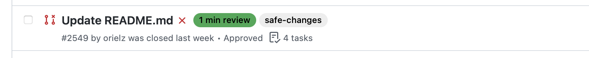

# Quick Start

## First automation – adding labels

Once completed installation, next step is to open a new PR, an easy check is to do minor change to the repository `README.md` file. When set with the default automation rules, your PR should get a colored labeled with `X min review` label and the `safe-changes` label on the PR, as you only changed documentation.



The `add-label` action is a great way to start and experience gitStream, even without hard automation, the additional context help to review PRs faster. Even better, adding the `approve` action for `safe-changes` will start saving developer's time. 

## Next, approving safe changes

You can open a new branch from your main branch, uncomment the default `.cm` rules, and open a PR.

```yaml+jinja hl_lines="17"
  safe_changes:
    # The `if` key has a list of conditions, each condition is specified as a Jinja expression
    # in a double curly braces. Expressions are evaluated by gitStream on a PR when triggered.
    if:
      # Given the PR code changes, check that only formatting changes were made 
      - {{ is.formatting or is.docs or is.tests }}
    # `run` key has a list of actions, which are executed one by one whenever the automation 
    # conditions are met. 
    run: 
      # When the changes are validated as formatting only, you can help to speed up the review 
      # by adding a label that marks it accordingly.
      - action: add-label@v1
        args:
          label: 'safe-changes'
      # You can uncomment the following action to get gitStream to automatically approve 
      # such PRs to save reviewers time for such changes.
      - action: approve@v1
```

Now, still on the new PR, edit also the `README.md` and commit to the branch. When you have a PR with changes to the `.cm` rules, gitStream will switch to dry-run mode. This mode is like a sandbox for testing new automation rules. When you are ready, remove all the changes except the `.cm` changes and merge the PR normally.

Well done! from now on safe changes won't require developer's time to review and approve them.


## What's next

Once you get the hang of it, you can set up more automation rules. 

An easy next step is to take a look at the [examples](/examples) page, you can choose various automation such as marking PRs with no tests, assigning the right reviewer – for example changes to the Japanese translation files can be automatically assigned to the right translator…

Download automation files and add them to your repository `.cm/` directory, experiment in dry-run mode, add labels and then switch to automatic actions.

!!! tip

	The `.cm` directory is located in the repository root and contains the automation files. Multiple rules files are supported.

This is only the beginning. With gitStream, you can create rules to automate your PRs. You understand what your team needs, and gitStream will help you get there.

## Something missing?

If something is missing, create a new enhancement request in the [project's issues page](https://github.com/linear-b/gitstream/issues).
