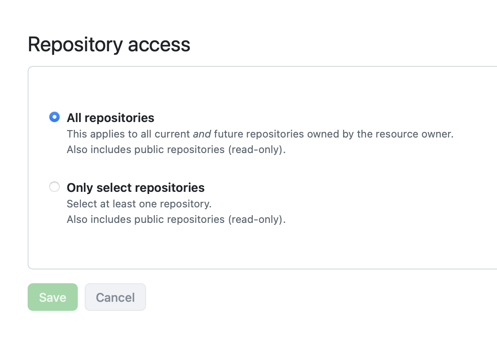
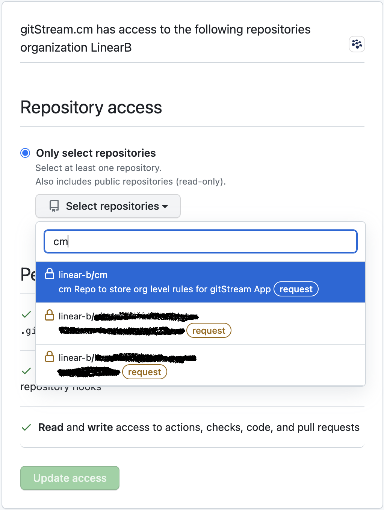
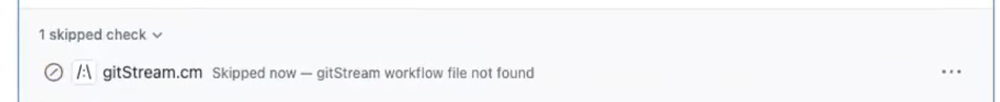

# Troubleshooting

## I can't see any action running

#### Did you install gitStream in your repo?
Check that you see gitStream app on repository's Settings > GitHub apps:


In case you don't see it, visit the marketplace and install it for free: https://github.com/marketplace/gitstream-by-linearb

#### Did you set the workflow files correctly?
Check you have placed these two files in your repository with these exact names:

1. `gitstream.cm` in the `cm` repo, (for org level installs), or `.cm/gitstream.cm` on all other repositories
2. `.github/workflows/gitstream.yml`

These files must be committed to the repository default branch (usually `master` or `main`). Notice that the action will not run until these files are found on the default branch.

Check that you see "gitStream workflow automation" in the Action section in your repository:


Next, if you see a failed action, check out the details:


#### Does your organization allows 3rd party actions?

Some organizations limit which actions can run, in that case, in the repository settings, you should enable it:


Also, add
```
linear-b/gitstream-github-action@v2,linear-b/gitstream-github-action@v2-lite,*/*/.github/workflows/gitstream.yml*
```
to the **Allow specified actions and reusable workflows** list, if it is shown.


#### Adding new repo? Make sure to enable gitStream for it

1. Go to https://github.com/apps/gitstream-cm and then
2. click the `Configure` button
3. If you see organization selection, choose the relevant org
4. Scroll down to `Repository access`
5. Make sure the repo you want is covered, i.e. either `All repositories` is checked or the repo is checked in the `Only select repositories` list



#### Using org level? Did you enable gitStream for your `cm` repo

Make sure you have added the `cm` repo to the repos gitStream should run on

#### Are you using the default runners along with the "IP allow list" feature on GitHub?
<a href="https://docs.github.com/en/enterprise-cloud@latest/organizations/keeping-your-organization-secure/managing-security-settings-for-your-organization/managing-allowed-ip-addresses-for-your-organization#using-github-actions-with-an-ip-allow-list" target="_blank">According to GitHub</a>, in order to use GitHub actions with the allow list, you must use self-hosted runners or GitHub-hosted larger runners with static IP address ranges and add their IP to the allow list.

When using GitHub's default runners, you will encounter the following error: "The repository owner has an IP allow list enabled, and [IP] is not permitted to access this repository," which indicates that GitHub is blocking the action. You can verify if the IP is part of GitHub's CIDR ranges by using the following <a href="https://api.github.com/meta" target="_blank">list</a>

#### Is the PR in Draft mode?

gitStream automations won't trigger for PRs that are in Draft mode.

#### I see 'gitStream workflow file not found' error

This error indicates that gitStream is unable to locate the file `.github/workflows/gitstream.yml`. The tool first searches for this file in the `cm` repository and then in the PR's repository. If the CI file is not found, this error message is displayed. To resolve this issue, ensure that your setup is correct and that the specified file exists in your repository.

## I have rules that should have blocked merge, but the PR can be merged still

For example, when using the [`set-required-approvals`](/automation-actions#set-required-approvals)
action, gitStream can ensure the PR got enough approvals before it can be merged. gitStream does that
by running as a check and marking the check conclusion as failed. In order for the PR to be blocked, gitStream should be set as a required check in the repo: [instructions here](/github-installation#github-merge-block).


## I can't set gitStream as required check

In order for gitStream to be listed as a required check, it needs to be triggered at least once in that repo. First create a new PR so gitStream is triggered.

Check it under repository's Settings > Branches:


## I don't want gitStream to run on PRs that was generated by a bot

When using repository level rules, you can edit the `.github/workflows/gitstream.yml` and uncomment the `if` line, you can edit and replace the bot name with the bot name you want to ignore (`dependabot[bot]` in the example below).

!!! note

    This will not work for org level rules

```yaml+jinja title=".github/workflows/gitstream.yml" hl_lines="5"
jobs:
  gitStream:
    timeout-minutes: 5
    # uncomment this condition, if you don't want any automation on dependabot PRs
    if: github.actor != 'dependabot[bot]'
    runs-on: ubuntu-latest
    name: gitStream workflow automation
    steps:
      - name: Evaluate Rules
        uses: linear-b/gitstream-github-action@v2
```

## gitStream fails and I don't understand why

gitStream check run can fail from different reasons, and these are shown in the check result.

#### Missing workflow file


When it says `gitStream.cm Skipped — gitStream workflow file not found`, it means that:
- The GitHub action was not found, check again that you have this file in your repository root: `.github/workflows/gitstream.yml`, see instructions on [GitHub installation](/github-installation)
- When using org level, then the required `cm` **repo** may not be in the GitHub application allowed repositories list. See instructions above: [enable gitStream for your `cm` repo](#using-org-level-did-you-enable-gitstream-for-your-cm-repo)

#### Syntax error in the cm files


Clicking the `Details` button will show more information and context.


You can add this automation to see details on context variable.

## gitStream fails when using template strings with special characters (e.g., colon ':')

If a template string (e.g., pull request title, description, or other context variables) contains special characters such as a colon (`:`), gitStream might fail with a YAML parsing error due to invalid syntax.

To resolve this issue, ensure you properly escape special characters by using Nunjucks multiline strings. For example:

```yaml+jinja
comment: |
  {{ pr.title }}
```

## GitHub timeout issues with large repositories

If you're experiencing timeout issues during GitHub Actions execution, particularly with large repositories or monorepos, this is typically caused by the time required to clone the entire repository history.

You can resolve this by using the **lite version** of the gitStream GitHub Action, which performs a shallow clone to reduce execution time:

```yaml
jobs:
  gitStream:
    timeout-minutes: 15
    runs-on: ubuntu-latest
    name: gitStream workflow automation
    steps:
      - name: Evaluate Rules
        uses: linear-b/gitstream-github-action@v2-lite
        id: rules-engine
```

**Important limitations of the lite version:**
- Automations that rely on Git history (such as `code-experts`) may not work properly due to the shallow clone
- Historical data analysis features will be limited
- Some context variables that depend on full Git history may return incomplete results

<div class="result" markdown>
  <span>
  [:octicons-download-24: Download gitstream.yml (lite version)](/downloads/gitstream-lite.yml){ .md-button }
  </span>
</div>

## How can I debug expressions and see their content?

You can dump any context value to the PR comment. For example, to see the list of changed files, use:

```yaml+jinja
automations:
  show_changed_files:
    if:
      - true
    run:
      - action: add-comment@v1
        args:
          comment: |
            FILES DUMP {{ files | dump | safe }}
            JS FILES DUMP {{ files | filter(regex=r/\.js$/) | dump | safe }}
```

<div class="result" markdown>

  <span>
  [:octicons-download-24: Download and add to your repo .cm directory](/downloads/debug.cm){ .md-button }
  </span>

</div>


## gitStream fails with syntax error after adding new rules

**IntelliJ IDEA** has automatic code styling for YAML that can break the `.cm` syntax, check the following _Settings/Preferences | Editor | Code Style | YAML --> Spaces | Code braces_ and make sure it is unchecked.


**VS Code** YAML plugin by Red Hat extension `[vscode-yaml](https://github.com/redhat-developer/vscode-yaml)` has automatic code styling for YAML that can break the `.cm` syntax, make sure you disable `bracketSpacing`
```json
{
    "yaml.format.bracketSpacing": false,
}
```

## Not here?

Create a new issue in the [project's issues](https://github.com/linear-b/gitstream/issues)
