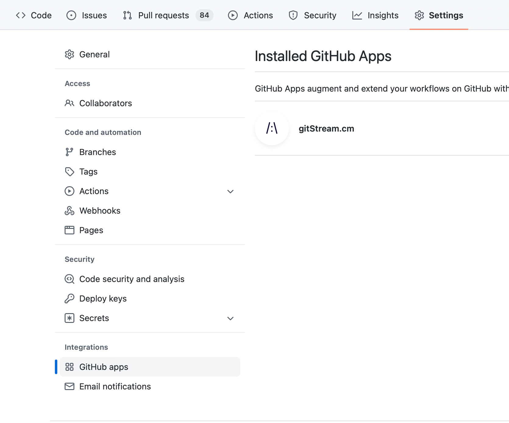
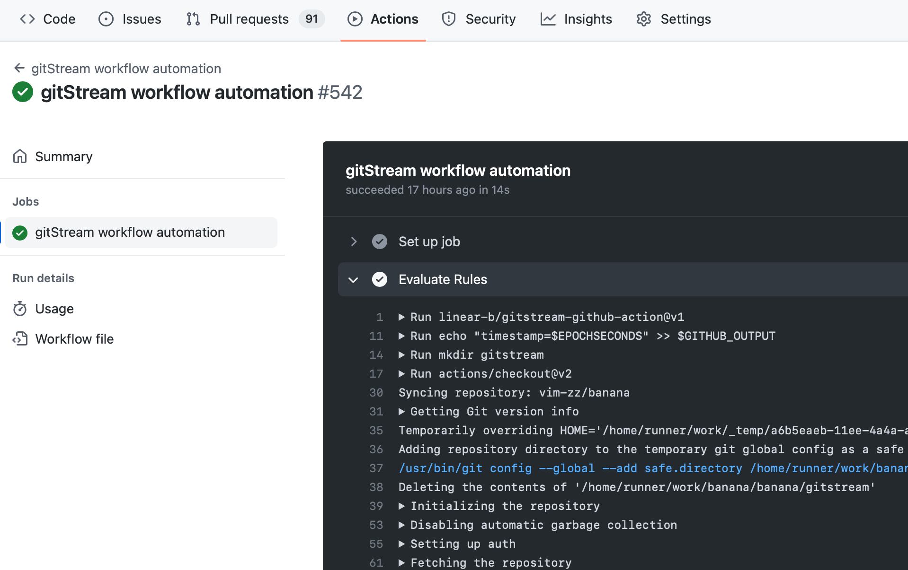
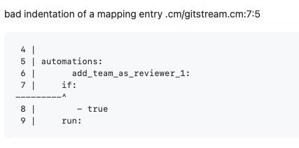
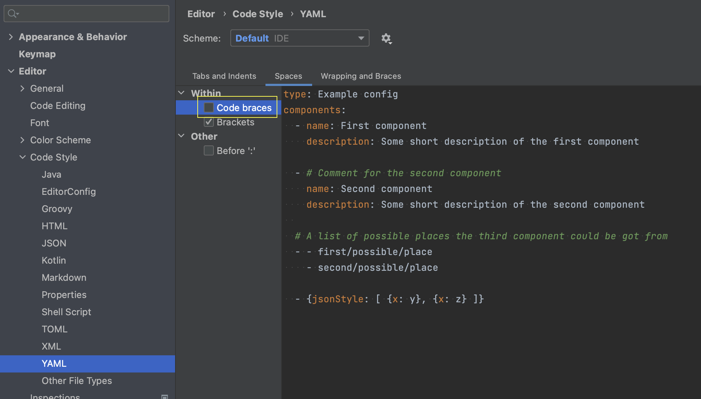

# Troubleshooting 

## I can't see any action running

**Did you install gitStream in your repo?**
Check that you see gitStream app on repository's Settings > GitHub apps:


In case you don't see it, visit the marketplace and install it for free: https://github.com/marketplace/gitstream-by-linearb

**Did you set the workflow files correctly?**
Check you have placed these 2 files in your repository, with these exact names: 

1. `.cm/gitstream.cm`
2. `.github/workflows/gitstream.yml`

These files need to be committed to the repository default branch (usually `master` or `main`).

Check that you see "gitStream workflow automation" on the Action section in your repository:


Next, if you see failed action, check out the details:



Some organization limit which actions can run, in that case in the repository settings you should enable it:


**Is the PR in Draft mode?**

gitStream automations won't trigger for PRs that in Draft mode.

## I have rules that should have blocked merge, but the PR can be merged still

For example, when using the [`set-required-approvals`](/automation-actions.md#set-required-approvals) 
action, gitStream can ensure the PR got enough approvals before it can be merged. gitStream does that 
by running as a check and marking the check conclusion as failed. In order for the PR to be blocked, gitStream should be set as a required check in the repo: [instructions here](/github-app-setup.md#Set-GitHub-repo-settings).


## I can't set gitStream as required check

In order for gitStream to be listed as a required check, it needs to be triggered at least once in that repo. First create a new PR so gitStream is triggered.

Check it under repository's Settings > Branches: 


## I don't want gitStream to run on PRs that was generated by a bot

You can edit the `.github/workflows/gitstream.yml` and uncomment the `if` line, you can edit and replace the bot name with the bot name you want to ignore (`dependabot[bot]` in the example below):

```yaml+jinja title=".github/workflows/gitstream.yml" hl_lines="5"
jobs:
  gitStream:
    timeout-minutes: 5
    # uncomment this condition, if you don't want any automation on dependabot PRs
    if: github.actor != 'dependabot[bot]'
    runs-on: ubuntu-latest
    name: gitStream workflow automation
    steps:
      - name: Evaluate Rules
        uses: linear-b/gitstream-github-action@v1
```

## gitStream fails and I don't understand why

gitStream check run can fail from different reasons, and these are shown in the check result. 

#### Missing workflow file

When it says `gitStream.cm Skipped — gitStream workflow file not found`, it means that the GitHub action was not found, check again that you have this file in your repository root: `.github/workflows/gitstream.yml`, see instructions on [GitHub installation](/github-installation.md).

#### Syntax error in the cm files


Clicking the `Details` button will show more information and context.



You can add this automation to see details on context variable.

## How can I debug expressions and see their content?

You can dump any context value to the PR comment. For example, to see the list of changed files, use:

```yaml+jinja
automations:
  show_changed_files:
    if:
      - true
    run:
      - action: add-comment@v1
        args:
          comment: |
            FILES DUMP {{ files | dump | safe }}
            JS FILES DUMP {{ files | filter(regex=r/\.js$/) | dump | safe }}
```

<div class="result" markdown>

  <span>
  [:octicons-download-24: Download and add to your repo .cm directory](/downloads/debug.cm){ .md-button }
  </span>

</div>


## gitStream fails with syntax error after adding new rules

**IntelliJ IDEA** has automatic code styling for YAML that can break the `.cm` syntax, check the following _Settings/Preferences | Editor | Code Style | YAML --> Spaces | Code braces_ and make sure it is unchecked.



**VS Code** YAML plugin by Red Hat extension `[vscode-yaml](https://github.com/redhat-developer/vscode-yaml)` has automatic code styling for YAML that can break the `.cm` syntax, make sure you disable `bracketSpacing`
```json
{
    "yaml.format.bracketSpacing": false,
}
```

## Not here?

Create a new issue in the [project's issues](https://github.com/linear-b/gitstream/issues)
